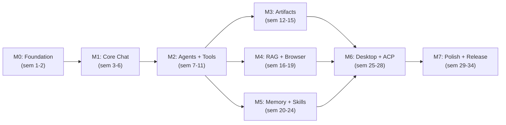

# HyprCollab — Implementation Plan

> **OpenSpec SSD v2.0** · Rust 2024 Edition · 9 Fases · 39 Semanas

---

## Dependencias entre Fases

M3, M4, M5 son **paralelizables** después de M2.

---

## Fase 0 — Foundation (Semanas 1-2)

### Semana 1: Scaffold + CI

- [ ] `cargo init --name hyprcollab` en ~/developments/hyprcollab/
- [ ] Crear Cargo workspace con todos los crates (20 miembros)
- [ ] Configurar CI: GitHub Actions (fmt, clippy, test, build)
- [ ] Crear repositorio GitHub `hyprcollab`
- [ ] Escribir README.md con badge de CI
- [ ] Crear `deny.toml` para auditoría de deps
- [ ] Crear `flake.nix` para dev shell
- [ ] Crear `Dockerfile` multi-stage

### Semana 2: Core Types + Traits

- [ ] `hyprcollab-core`: tipos compartidos (ChatRequest, Message, Artifact, ToolCall, etc.)
- [ ] `hyprcollab-core`: traits (LlmProvider, Tool, AcpConnector, PlatformAdapter, SlashCommand)
- [ ] `hyprcollab-core`: error types (thiserror)
- [ ] `hyprcollab-core`: tests unitarios de tipos
- [ ] `hyprcollab-config`: GlobalConfig struct + serde_yaml loading + env var interpolation
- [ ] `hyprcollab-config`: FolderConfig struct + `.hyprcollab/config.yaml` auto-detection
- [ ] `hyprcollab-config`: AgentConfig struct + frontmatter YAML parser
- [ ] `hyprcollab-config`: ChatConfig struct + SQLite `chat_settings` table
- [ ] `hyprcollab-config`: ConfigResolver (4-layer merge: global → folder → agent → chat)
- [ ] `hyprcollab-memory`: schema SQLite + migraciones (todas las tablas incluyendo chat_settings, folder_configs, approval_rules, registered_agents)
- [ ] `hyprcollab-memory`: CRUD básico de conversaciones y mensajes
- [ ] `hyprcollab-memory`: tests con DB in-memory
- [ ] `hyprcollab-approval`: ApprovalRule types + ApprovalEngine skeleton

**Milestone 0:** Workspace compila, CI verde, SQLite migrations corren, ~20 crates.

---

## Fase 1 — Core Chat + Slash Commands (Semanas 3-6)

### Semana 3: LLM Router

- [ ] `hyprcollab-provider-openai`: trait LlmProvider para OpenAI
- [ ] `hyprcollab-provider-openai`: streaming SSE (reqwest + tokio-stream)
- [ ] `hyprcollab-provider-openai`: embeddings endpoint
- [ ] `hyprcollab-provider-anthropic`: Messages API + streaming
- [ ] Tests unitarios por provider con mock server

### Semana 4: Más Providers + Native GGUF + Router + Slash Commands

- [ ] `hyprcollab-provider-ollama`: API compatible, auto-discover models
- [ ] `hyprcollab-provider-openrouter`: aggregator
- [ ] `hyprcollab-provider-native`: llama.cpp bindgen — GGUF loading, GPU layers
- [ ] `hyprcollab-provider-native`: candle backend (pure Rust, sin C deps)
- [ ] `hyprcollab-provider-native`: mistral.rs backend (ISQ quant, Flash Attn)
- [ ] `hyprcollab-provider-native`: HuggingFace auto-download via hf-hub
- [ ] `hyprcollab-provider-native`: Model registry (`~/.local/share/hyprcollab/models/`)
- [ ] `hyprcollab-provider-native`: Hot-swap: load/unload sin reiniciar
- [ ] Router: selección por model name, fallback config
- [ ] Router: parse `provider/model` format (anthropic/claude-sonnet-4, native/llama-3.3)
- [ ] `/model list` — lista todos los modelos (native + API + local)
- [ ] `/model download <repo> <quant>` — descargar GGUF desde HuggingFace
- [ ] `/model status` — GPU/CPU usage, modelos en memoria
- [ ] `hyprcollab-config`: FolderDetector (walk up from cwd to find `.hyprcollab/`)
- [ ] `hyprcollab-config`: inotify hot-reload de folder config
- [ ] `hyprcollab-config`: API endpoints `GET /api/config/*`
- [ ] `hyprcollab-commands`: SlashCommand trait + parser básico
- [ ] Implementar `/model`, `/workspace`, `/help`, `/config`

### Semana 5: Axum Server

- [ ] `hyprcollab-server`: Axum app con routes
- [ ] POST `/api/chat/completions` → SSE stream
- [ ] GET/DELETE `/api/conversations`
- [ ] GET `/api/conversations/:id`
- [ ] AppState con DB pool + LLM router
- [ ] CORS middleware

### Semana 6: Frontend Chat + Terminal UI

- [ ] Dioxus setup con `dx serve`
- [ ] Chat panel: lista de mensajes
- [ ] Input con auto-resize
- [ ] SSE consumer: streaming de tokens
- [ ] Estilo terminal-dark (#0d1117, JetBrainsMono NF)
- [ ] Sidebar de conversaciones
- [ ] Slash command autocomplete en input

**Milestone 1:** Chat funciona end-to-end con streaming. Multi-provider. UI terminal. Slash commands básicos.

---

## Fase 2 — Agents + Tools + Approval (Semanas 7-11)

### Semana 7: Agent Runtime Core

- [ ] `hyprcollab-agent`: integrar rig-rs
- [ ] AgentSession con system prompt dinámico
- [ ] Agent loop: prompt → LLM → tool call → execute → loop
- [ ] Max-turns limit
- [ ] Tool registry (HashMap<String, Box<dyn Tool>>)

### Semana 8: Built-in Tools + Approval

- [ ] `hyprcollab-tools/shell`: ejecutar comandos (sandboxed)
- [ ] `hyprcollab-tools/file_ops`: leer/escribir archivos
- [ ] `hyprcollab-tools/web_search`: Brave/SearXNG API
- [ ] `hyprcollab-tools/web_fetch`: HTTP fetch + parse
- [ ] `hyprcollab-tools/memory_tools`: store/search en memoria
- [ ] `hyprcollab-approval`: ApprovalEngine completo
- [ ] `hyprcollab-approval`: rule matching (tool, pattern, workspace)
- [ ] API: GET/POST `/api/approval/pending`, approve, deny, modify

### Semana 9: Shell Tool Enhanced + Background Processes

- [ ] Shell tool con CWD tracking
- [ ] Environment variables management
- [ ] Background process: start, stop, status, output streaming
- [ ] PTY allocation para comandos interactivos
- [ ] Timeout configurable por comando
- [ ] Output capture: stdout + stderr separados

### Semana 10: Tool Visualization + Approval UI

- [ ] Frontend: componente ToolCall (nombre, params, output, duración)
- [ ] Frontend: thinking/reasoning display (colapsable)
- [ ] Frontend: Approval dialog (Approve/Deny/Modify)
- [ ] Backend: estructurar tool calls en SSE events
- [ ] Approval log en SQLite

### Semana 11: Slash Commands Agénticos

- [ ] `hyprcollab-commands`: file-based loading (.md con frontmatter YAML)
- [ ] `/agent <name>`: carga agent.md → injecta system prompt + tools → actualiza chat_settings
- [ ] `/skill <name>`: carga skill.md → injecta procedure
- [ ] `/temperature <val>`: ajusta temperatura del chat actual
- [ ] `/approval <mode>`: cambia approval_mode (strict/normal/relaxed) del chat
- [ ] `/run <cmd>`: ejecuta con approval check
- [ ] `/browse <url>`: abre browser (placeholder)
- [ ] `/design`, `/review`: carga .md y cambia modo
- [ ] Autocompletado de comandos + argumentos

**Milestone 2:** Agente autónomo con tools, approval system, slash commands completos.

---

## Fase 3 — Artifacts Canvas + TUI (Semanas 12-15)

### Semana 12: Artifact Types + Backend

- [ ] `hyprcollab-artifacts`: enum Artifact + serde
- [ ] POST/GET/PUT `/api/artifacts`
- [ ] Artifact creation desde agent (tool `artifact_create`)
- [ ] Almacenamiento en filesystem + metadata SQLite
- [ ] Inline artifacts: embebidos en mensajes del chat

### Semana 13: Canvas Frontend

- [ ] Panel lateral de canvas (resizable, toggleable)
- [ ] Code preview: syntax highlighting (tree-sitter WASM)
- [ ] Markdown preview: pulldown-cmark → HTML
- [ ] SVG preview: inline render via resvg
- [ ] Mermaid diagram render (mermaid.js WASM)
- [ ] Artifact tabs (múltiples artifacts por conversación)

### Semana 14: Canvas Advanced + Media Preview

- [ ] HTML preview en iframe sandboxed
- [ ] LaTeX/KaTeX math render
- [ ] Edit mode: usuario edita artifact → auto-save → agente ve cambios
- [ ] Diff view (cambios del agente vs versión usuario)
- [ ] `hyprcollab-media-preview`: terminal capability detection
- [ ] `hyprcollab-media-preview`: kitty graphics protocol encoder
- [ ] `hyprcollab-media-preview`: sixel fallback encoder
- [ ] Image preview: PNG/JPG/WebP
- [ ] Code preview: syntect syntax highlight
- [ ] SVG preview: resvg → PNG → kitty protocol

### Semana 15: TUI Mode + WebSocket

- [ ] `hyprcollab-tui`: ratatui setup + crossterm backend
- [ ] TUI layout: chat pane + artifact pane
- [ ] Kitty image protocol integration en TUI
- [ ] Vim-like keybinds (j/k, gg/G, i, :commands)
- [ ] WS `/ws/artifacts/:id` para live updates
- [ ] PDF preview (primera página renderizada)
- [ ] Markdown preview en TUI

**Milestone 3:** Canvas de artifacts con inline render. TUI funcional con kitty image preview.

---

## Fase 4 — RAG Pipeline + Browser Engine (Semanas 16-19)

### Semana 16: Document Parsers

- [ ] `hyprcollab-rag/parser`: PDF (pdf-rs)
- [ ] `hyprcollab-rag/parser`: Markdown (pulldown-cmark)
- [ ] `hyprcollab-rag/parser`: Code files (tree-sitter chunking)
- [ ] `hyprcollab-rag/parser`: Plain text, CSV, JSON
- [ ] `hyprcollab-rag/parser`: HTML (html5ever)
- [ ] Parser tests con archivos reales

### Semana 17: Chunking + Embeddings + Store

- [ ] `hyprcollab-rag/chunker`: RecursiveCharacter con overlap
- [ ] `hyprcollab-rag/embedder`: integración con provider embeddings
- [ ] `hyprcollab-rag/store`: LanceDB conexión, upsert, search
- [ ] Tabla `documents` en SQLite
- [ ] POST `/api/rag/upload` → parse → chunk → embed → store

### Semana 18: Browser Engine

- [ ] `hyprcollab-browser`: Playwright integration (Rust bindings → playwright-cli)
- [ ] `hyprcollab-browser`: BrowserPool con session management por chat
- [ ] `hyprcollab-browser`: Screenshot capture, JS execution, form interaction
- [ ] `hyprcollab-browser`: Multi-engine support (Chromium, Firefox, WebKit)
- [ ] `web_navigate(url)` → PageSnapshot
- [ ] `web_screenshot()` → PNG bytes
- [ ] `web_extract(selector)` → structured data
- [ ] Cookie jar persistente
- [ ] Browser config (viewport, timeout, user agent)

### Semana 19: Image Generation

- [ ] `hyprcollab-image`: ImageProvider trait + ImageRouter
- [ ] `hyprcollab-image`: DALL-E 3 provider (OpenAI API)
- [ ] `hyprcollab-image`: Flux provider (FAL / Replicate API)
- [ ] `hyprcollab-image`: ComfyUI provider (REST API + MCP)
- [ ] `hyprcollab-image`: Automatic1111 provider (REST API + MCP)
- [ ] `image_generate` agent tool con routing automático
- [ ] `/image` slash commands (generate, upscale, vary, providers, history)
- [ ] Preview: inline en chat + kitty protocol TUI + artifact save
- [ ] Config en config.lua con providers configurables

### Semana 20: Browser + RAG + Image Integration

- [ ] `web_interact(action, target)` → click, type, scroll
- [ ] `web_js_execute(code)` → sandboxed JS
- [ ] RAG auto-indexing: páginas visitadas → chunks → LanceDB
- [ ] Query pipeline: embed query → vector search → rerank → inject
- [ ] Citación de sources en respuesta
- [ ] RAG panel en frontend + workspace RAG scope

**Milestone 4:** RAG funcional. Browser embebido. Auto-indexing de web a RAG.

---

## Fase 5 — Memory + Skills + Extra (Semanas 21-25)

### Semana 21: Working Memory

- [ ] `hyprcollab-memory/working_memory`: CRUD de facts
- [ ] Auto-extracción de facts post-conversation (LLM call)
- [ ] Categorías: preference, fact, pattern, correction
- [ ] Confidence scoring
- [ ] GET/POST/DELETE `/api/memory/facts`

### Semana 22: Memory + Search + Themes

- [ ] Inyección de working memory en system prompt
- [ ] Memory search: FTS5 + semantic search híbrido
- [ ] Memory pruning: cleanup de facts de baja confianza
- [ ] Frontend: panel de memoria
- [ ] Theme engine: CSS variables system
- [ ] Themes: terminal-dark, catppuccin, nord, dracula, tokyo-night
- [ ] Custom theme loading desde ~/config/hyprcollab/themes/

### Semana 23: Skills Engine + Auto-Learning

- [ ] `hyprcollab-skills/loader`: parse YAML skills
- [ ] `hyprcollab-skills/matcher`: trigger pattern matching
- [ ] Skill injection en system prompt cuando match
- [ ] `hyprcollab-skills/learner`: detectar patrones repetidos
- [ ] Auto-generar skill YAML desde conversaciones
- [ ] Usage tracking y success rate

### Semana 24: Extra Features I

- [ ] Conversation branching: fork desde cualquier mensaje
- [ ] Tree structure en conversations (parent_id)
- [ ] Bookmarks: marcar mensajes importantes
- [ ] Pinned conversations: fijar en sidebar
- [ ] FTS5 full-text search sobre conversaciones
- [ ] GET `/api/conversations/search?q=`

### Semana 25: Extra Features II

- [ ] Token usage tracking: dashboard por modelo, día, workspace
- [ ] Export: Markdown, JSON (PDF/PNG en siguiente fase)
- [ ] Prompt templates: library con variable interpolation
- [ ] Session persistence: reabrir donde se dejó
- [ ] Code block actions: copy, download, open in editor
- [ ] Drag & drop file upload

**Milestone 5:** Memoria evolutiva + skills auto-aprendidas. Branching, search, export.

---

## Fase 6 — Desktop (Tauri) + Web Terminal-Like + ACP + Mobile (Semanas 26-29)

> **Filosofía:** Web + Desktop se sienten como una terminal real.
> Ver [FASE6-PLAN.md](./FASE6-PLAN.md) para arquitectura detallada.

### Semana 26: Tauri 2.0 Setup + PTY Bridge

- [ ] `hyprcollab-tauri`: Tauri 2.0 scaffold (src-tauri/ + src/ frontend)
- [ ] PTY bridge: portable-pty 0.9 → spawn shell real (bash/zsh/fish)
- [ ] IPC Commands: pty_create, pty_write, pty_resize, pty_kill
- [ ] IPC Events: pty-output → streaming bidireccional
- [ ] xterm.js v6.0 + addon-webgl (GPU 60fps) + addon-fit + addon-image
- [ ] Terminal theme: bg #0d1117, fg #e6edf3, cursor #58a6ff, JetBrainsMono NF
- [ ] System tray icon + global shortcuts + window state persistence
- [ ] Native notifications + auto-update (Tauri plugins)
- [ ] Tests: 15+ PTY (create, write, read, resize, kill, multi-session)

### Semana 27: Chat Terminal Renderer + ACP Connector

- [ ] `hyprcollab-terminal-render`: Chat → ANSI renderer
- [ ] User messages: `▌ You 14:30` con accent color
- [ ] Assistant messages: `▌ Persona` con purple, markdown→ANSI parsing
- [ ] Tool calls: bloques colapsables cyan (╭─ name ─)
- [ ] Artifacts inline: código con syntax highlight, imágenes via kitty protocol
- [ ] `hyprcollab-acp/connector`: trait AcpConnector (spawn, send, read, terminate)
- [ ] Implementaciones: ClaudeCodeConnector, CodexConnector, AgYConnector
- [ ] ACP events: Token, ToolCallStart, ToolCallEnd, Error, Done
- [ ] Tests: 20+ (ANSI rendering, markdown→ANSI, artifact, ACP mock)

### Semana 28: Sidebar Dioxus + Chat Integration + ACP Monitor

- [ ] Sidebar Dioxus: 3 tabs (💬 Chats, 📁 Projects, 🎭 Personas)
- [ ] Chat input: Dioxus overlay (textarea + slash command autocomplete)
- [ ] Chat end-to-end: input → Axum backend → LLM → SSE → ChatRenderer → ANSI → xterm.write()
- [ ] ACP Monitor panel: lista sesiones, mini-xterm streams, tool call cards
- [ ] File drag & drop, image attach (kitty protocol preview)
- [ ] Tests: 15+ (sidebar, input handling, ACP sessions)

### Semana 29: Voice + Multi-model Compare + PWA + Polish

- [ ] `hyprcollab-voice`: Whisper.cpp bindgen (whisper-rs) + cpal audio capture
- [ ] Push-to-talk (Space → grabar → transcribe → send)
- [ ] TTS: edge-tts integration → audio response playback
- [ ] Multi-model compare: ParallelProvider → split pane (tmux-style)
- [ ] Diff view: respuestas lado a lado con colores distintos
- [ ] `hyprcollab-pwa`: PWA manifest + service worker + touch UI
- [ ] Polish: cursor blink, fade-in, smooth scroll, tab management
- [ ] Tests: 10+ (voice mock, parallel provider, PWA validation)

**Milestone 6:** Desktop app Tauri con PTY real. Chat como ANSI terminal. ACP visualization. PWA mobile. Voice mode.

---

## Fase 7 — Polish + Release (Semanas 30-35)

### Semana 30: MCP Client + Integración

- [ ] `hyprcollab-mcp`: conectar a servidores MCP (stdio transport)
- [ ] Tool discovery dinámico
- [ ] Exponer MCP tools al agent runtime
- [ ] `/mcp` slash command completo
- [ ] Tests con server MCP de ejemplo

### Semana 31: Testing Full-Stack

- [ ] Tests de integración full-stack
- [ ] Tests E2E con Playwright
- [ ] Property tests (proptest) para agent loop
- [ ] Snapshot tests (insta) para artifact rendering
- [ ] Benchmark tests (criterion) para streaming
- [ ] Fuzz testing para slash command parser

### Semana 32: Documentation

- [ ] API documentation (rustdoc + mdbook)
- [ ] User guide: instalación, configuración, uso
- [ ] Theme customization guide
- [ ] Slash commands reference
- [ ] Agent/Skill authoring guide
- [ ] Architecture decision records (ADRs)

### Semana 33: Packaging

- [ ] PKGBUILD para AUR (`hyprcollab`, `hyprcollab-bin`, `hyprcollab-git`)
- [ ] Docker image optimizado (multi-stage, < 100MB)
- [ ] Nix flake con dev shell + package
- [ ] AppImage para Linux
- [ ] `.dmg` para macOS
- [ ] GitHub Release workflow con GPG sign

### Semana 34: Final Polish

- [ ] Performance profiling + optimization
- [ ] Memory leak detection (valgrind/ASAN)
- [ ] Accessibility audit (keyboard nav, screen readers)
- [ ] Error message review (user-friendly)
- [ ] Final UI polish (animations, transitions)
- [ ] README final con screenshots + demo GIF

### Semana 35: Release

- [ ] Tag v0.1.0
- [ ] GitHub Release con notes + binaries
- [ ] AUR publish
- [ ] Docker Hub publish
- [ ] Demo video para README
- [ ] Post en Reddit (r/rust, r/LocalLLaMA, r/selfhosted, r/archlinux)

**Milestone 7:** v0.1.0 released. Desktop app + web + TUI. AUR + Docker + GitHub.

---

## Fase 7.5 — Extensions + Lua + Persona + Marketplace (Semanas 36-39)

### Semana 36: Lua Config Engine + Extension API

- [ ] `hyprcollab-lua`: mlua integration con sandbox restringido
- [ ] `hyprcollab-lua`: load config.lua → GlobalConfig struct
- [ ] `hyprcollab-lua`: folder config.lua auto-detection + hot-reload
- [ ] `hyprcollab-lua`: Lua sandbox (whitelist libs, time limit, no io.write)
- [ ] `hyprcollab-ext`: Extension trait + ExtensionRegistry
- [ ] `hyprcollab-ext`: ExtensionLoader (WASM via wasmtime + Lua via mlua)
- [ ] `hyprcollab-ext`: extension.toml parser + validator
- [ ] `hyprcollab-ext`: ExtensionContext (storage, http, notifications)
- [ ] Migrar config.yaml → config.lua con backward compatibility

### Semana 37: Sidebar Modular + UI Registry + Matugen Theming

- [ ] `hyprcollab-ui`: SidebarModule trait + SidebarRegistry
- [ ] `hyprcollab-ui`: PanelModule trait + PanelRegistry
- [ ] `hyprcollab-ui`: StatusBar slot system
- [ ] `hyprcollab-ui`: ThemeManager — Matugen colors.json watcher (inotify)
- [ ] `hyprcollab-ui`: ThemeManager — map Matugen colors → DesignTokens
- [ ] `hyprcollab-ui`: ThemeManager — hot-reload UI sin restart (<100ms)
- [ ] `hyprcollab-ui`: Static presets (catppuccin-mocha, dracula, nord, tokyo-night, github-dark)
- [ ] `hyprcollab-ui`: Custom theme via config.lua
- [ ] `extensions/ext-chat-list`: Sidebar section de chats
- [ ] `extensions/ext-agents`: Sidebar section de agents (list, click to load)
- [ ] `extensions/ext-skills`: Sidebar section de skills (list, drag to activate)
- [ ] `extensions/ext-mcp`: Sidebar section de MCP servers (status, connect/disconnect)
- [ ] `extensions/ext-acp`: Sidebar section de ACP sessions
- [ ] `extensions/ext-artifacts`: Panel module de artifacts canvas
- [ ] Sidebar: drag & drop agents/skills al chat
- [ ] Sidebar: colapsable por sección, icon-only mode

### Semana 38: Persona + Agent Roles + Avatar + Marketplace

- [ ] `hyprcollab-persona`: Persona struct + PersonaConfig (personality traits: tone, language, length, formality, humor)
- [ ] `hyprcollab-persona`: AgentRole struct (tools, system prompt, approval, max_turns)
- [ ] `hyprcollab-persona`: PersonaPlugin trait (inject_prompt, filter_response, behavior_modifiers)
- [ ] `hyprcollab-persona`: ActivePersona —Persona + optional AgentRole + per-chat overrides
- [ ] `hyprcollab-persona`: Persona loader from `~/config/hyprcollab/personas/<name>.lua`
- [ ] `hyprcollab-persona`: Agent role loader from `~/config/hyprcollab/agents/<name>.md`
- [ ] `hyprcollab-persona`: Avatar enum (Emoji, Image, Url, Generated, Initials) + AvatarManager
- [ ] `hyprcollab-persona`: UserProfile with avatar, stored in settings
- [ ] `extensions/ext-personas`: Persona sidebar module (list, detail, create)
- [ ] `extensions/ext-agents`: Agent Roles sidebar module (list, assign to persona)
- [ ] Avatar rendering: 40x40 in chat messages (persona + user), sidebar, fallback → initials
- [ ] `/persona` commands: list, load, create, edit, reset
- [ ] `/agent` commands: list, assign, unassign, create
- [ ] `hyprcollab-marketplace`: PackageProvider trait
- [ ] `hyprcollab-marketplace`: Multi-provider registry (fetch registry.json from URLs)
- [ ] `hyprcollab-marketplace`: Package installer (download, verify checksum, extract)
- [ ] `hyprcollab-marketplace`: marketplace.lua config (providers con auth)
- [ ] `hyprcollab-marketplace`: `/marketplace` commands (search, install, update, remove, providers)
- [ ] `extensions/ext-marketplace`: Sidebar section de marketplace browser

### Semana 39: Zed Integration + Polish

- [ ] `integrations/hyprcollab-zed`: Zed extension scaffold (Rust WASM)
- [ ] `hyprcollab-zed`: Assistant panel (HTTP a localhost:8420)
- [ ] `hyprcollab-zed`: Code context injection (file open + selection)
- [ ] `hyprcollab-zed`: Inline actions (Explain, Refactor, Test, Review)
- [ ] Integration tests: full extension lifecycle (load → use → unload)
- [ ] Integration tests: Lua config sandbox security
- [ ] Integration tests: Marketplace install → verify → remove
- [ ] Integration tests: Persona plugin pipeline

**Milestone 7.5:** Extension system, Lua config, personality, marketplace, Zed integration.

---

## Resumen de Milestones (Actualizado)

 Hito | Semana | Feature Principal | Crates | Líneas Est. |
------|--------|------------------|--------|-------------|
 M0 | 2 | Scaffold + Core types | 3 | ~2,000 |
 M1 | 6 | Chat streaming + UI + slash cmds | 7 | ~7,000 |
 M2 | 11 | Agent + Tools + Approval | 5 | ~7,000 |
 M3 | 15 | Artifacts Canvas + TUI + Kitty | 3 | ~6,000 |
 M4 | 20 | RAG Pipeline + Browser Engine + Image Gen | 3 | ~6,000 |
 M5 | 25 | Memory + Skills + Extras | 3 | ~6,000 |
 M6 | 29 | Tauri + ACP + Voice + Mobile | 4 | ~5,000 |
 M7 | 35 | Polish + Release v0.1.0 | 0 | ~3,000 |
 M7.5 | 39 | Extensions + Lua + Persona + Marketplace + Zed | 6 | ~8,000 |
 **Total** | **39** | **~32 crates + 8 extensions + 1 integration** | **32** | **~54,000** |

---

## Estrategia de Agentes

**Claude Code** para:
- Crates complejos (agent runtime, memory engine, browser engine)
- Code review de cada milestone
- Debugging de issues de compilación Rust
- Escritura de tests

**Antigravity CLI (agy)** para:
- Frontend Dioxus components
- Tauri desktop integration
- CI/CD pipeline
- AUR/Docker packaging
- Documentation

### Workflow:

1. Escribir plan de cada task
2. Delegar a Claude Code via `claude -p` (backend crates)
3. Delegar a agy via `agy -p` (frontend + infra)
4. Review cruzado
5. Integrar + test local
6. Commit + push

---

## Riesgos y Mitigaciones por Fase

- **F1:** Streaming SSE en Dioxus WASM → Usar `gloo-net` + `web-sys` directamente
- **F2:** rig-rs no soporta function calling → Custom agent loop con reqwest
- **F3:** Artifact rendering lento en WASM → SSR hibrido, lazy loading
- **F4:** LanceDB bindings inestables → Fallback a `sqlite-vec` o Qdrant
- **F4:** Playwright overhead → Fallback a reqwest+scraper para scraping simple
- **F6:** Tauri 2.0 mobile inmaduro → PWA como alternativa
- **F7:** Kitty protocol pocas terminales → Sixel fallback, graceful degrade
- **F8:** Scope creep → MVP estricto P0, features P1/P2 en fases posteriores
