# HyprCollab — Product Requirements Document

> **OpenSpec SSD v2.0** · Agentic AI Chat Platform · Rust-Native · Multi-Platform

---

## 1. Resumen Ejecutivo

**HyprCollab** es una plataforma de chat agéntico open-source escrita 100% en Rust que fusiona lo mejor de cuatro proyectos de referencia:

- **LibreChat** → Visual UX + Artifacts + MCP
- **AnythingLLM** → Pipeline RAG + gestión documental + workspaces
- **ClaudeCodeUI** → Visualización ACP + agent sessions
- **Hermes Agent** → Memoria evolutiva + skills + aprendizaje automático

**Diferencial:** Multi-plataforma nativa con estética terminal-first. Desktop app (Tauri), web server, mobile (PWA), y TUI (terminal). No es un ChatGPT clone — es una herramienta para desarrolladores que respira consola.

**Nombre:** HyprCollab (plataforma de colaboración humano+IA para desarrolladores)
**Stack:** Rust fullstack — Axum + Tauri 2.0 + Dioxus WASM + rig-rs
**Licencia:** MIT
**Deploy:** Self-hosted first, AUR + Docker + Nix + AppImage

---

## 2. Diagramas de Arquitectura

### 2.1 Arquitectura General

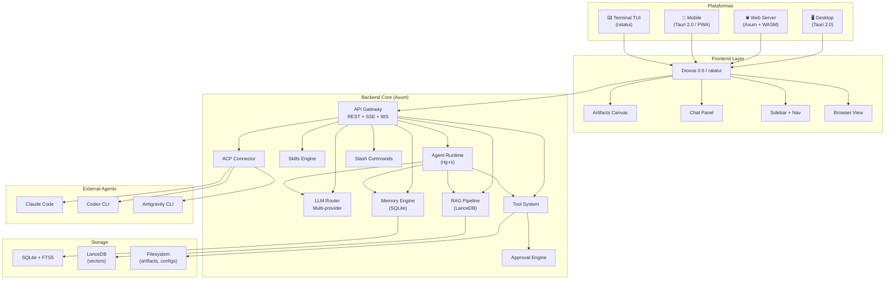

### 2.2 User Journey

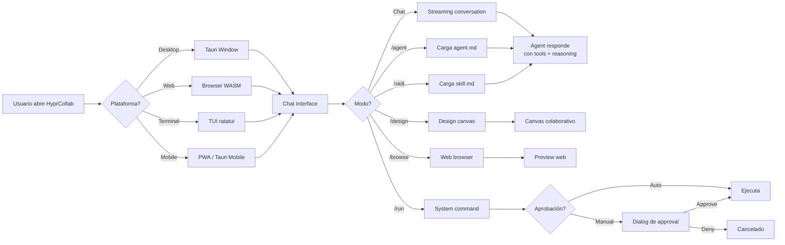

### 2.3 Flujo de Aprobación de Ejecuciones

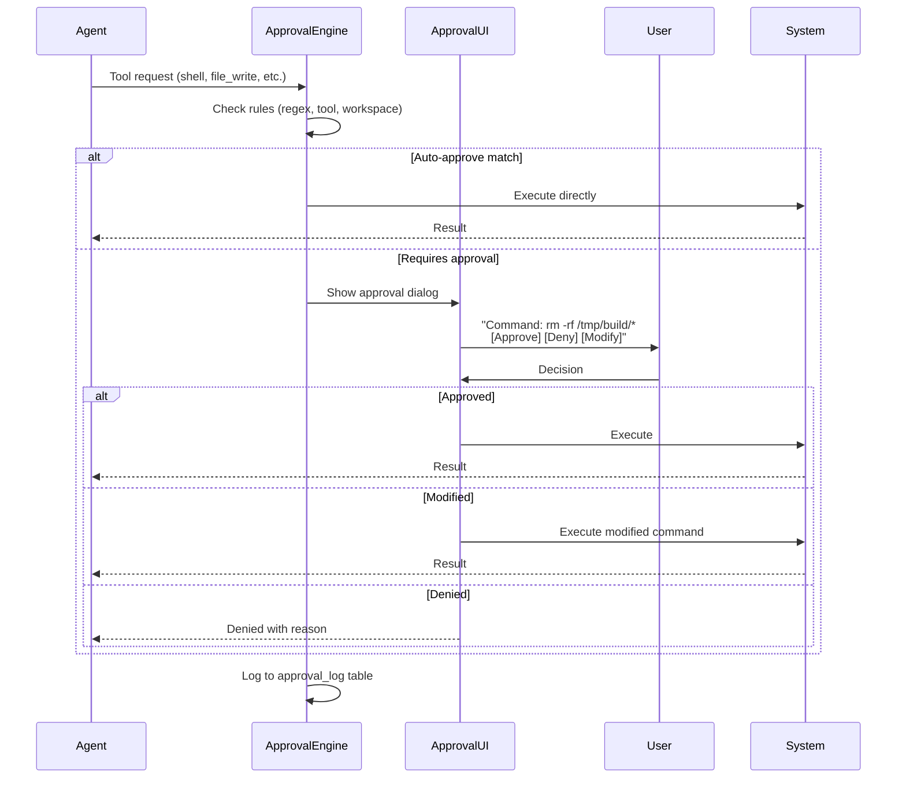

---

## 3. Tech Stack

- **Backend Core:** Rust + Axum 0.8 — performance, safety, async-native
- **Agent Runtime:** rig-rs (0xPlaygrounds/rig) ⭐7.4k — framework LLM Rust
- **Frontend Web:** Dioxus 0.6 ⭐36k — fullstack Rust → WASM
- **Desktop App:** Tauri 2.0 — compila a binario nativo (Linux/macOS/Windows)
- **TUI:** ratatui + crossterm — terminal UI para modo consola
- **Mobile:** Tauri 2.0 mobile target + PWA manifest
- **DB Principal:** SQLite (rusqlite) + FTS5 — local-first, zero-config
- **DB Vectorial:** LanceDB (Rust native) — RAG embeddings
- **Browser Engine:** Playwright (via playwright-cli + Rust bindings) — navegación web nativa
- **Image Preview:** kitty graphics protocol + sixel fallback (TUI mode)
- **Image Generation:** Multi-backend (DALL-E / Flux via API, ComfyUI, Automatic1111 via MCP/API)
- **MCP:** rust-mcp-sdk — Model Context Protocol nativo
- **Voice:** Whisper.cpp (bindgen) + edge-tts — input/output local
- **Auth:** JWT + OAuth2 — multi-user seguro
- **Config:** Lua scripts (mlua) — XDG: ~/config/hyprcollab/config.lua. Fallback YAML legacy.
- **Plugin System:** WASM + Lua extensions — modular como VS Code extensions

---

## 4. Modos de Plataforma

### 4.1 Desktop App (Tauri 2.0)

- Binario compilado nativo para Linux (AppImage/AUR), macOS (.dmg), Windows (.msi)
- WebView2/WebKit integrado — sin navegador externo
- Acceso nativo: filesystem, system tray, notifications, global shortcuts
- Ventana con tabs, sidebar resizable, canvas panel
- Auto-update integrado

### 4.2 Web Server

- `hyprcollab serve` → Axum sirve frontend WASM compilado
- Accesible desde cualquier navegador en red local
- PWA-ready: manifest.json, service worker, offline mode
- Responsive design para tablets y mobile browsers

### 4.3 TUI Mode (Terminal)

- `hyprcollab tui` → interfaz ratatui en terminal
- Kitty image protocol: preview de imágenes, PDFs, código directamente en terminal
- Sixel fallback para terminales que no soportan kitty
- Vim-like keybinds: j/k navegar, Enter enviar, Tab completar
- Split pane: chat + artifact preview lado a lado
- Detección automática de capabilities de la terminal

### 4.4 Mobile

- Tauri 2.0 mobile: iOS + Android targets
- PWA: installable desde browser con push notifications
- Touch-optimized: swipe para sidebar, pull-to-refresh
- Voice mode: push-to-talk con STT/TTS

---

## 5. UI Layout — Sidebar Modular

El layout principal tiene **3 paneles** resizeables, inspirado en VS Code y LibreChat:

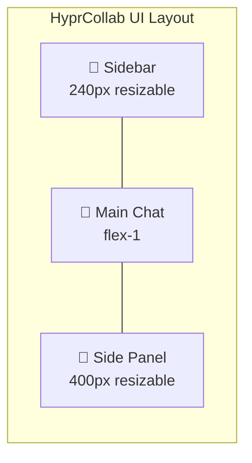

### 5.1 Sidebar Izquierda — Navegación Modular

La sidebar tiene **secciones colapsables** (como VS Code explorer). Cada sección es un **módulo visual** que se registra vía el Extension API:

- **💬 Chats** — Lista de conversaciones (recientes, pinned, search)
- **📁 Projects** — Workspaces/folders abiertos, con indicador de folder config activa
- **🎭 Personas** — Personas creadas (con personalidad, tono, estilo). Cada persona puede tener un rol de agente asignado. Click para cargar
- **🤖 Agents** — Roles de agente disponibles (toolkits, system prompts, approval rules). Se asignan a personas
- **⚡ Skills** — Skills instaladas. Drag al chat para activar
- **🔌 MCP Servers** — Servidores conectados, status indicator
- **📡 ACP Sessions** — Sesiones activas (Claude Code, Codex, AGY)
- **🧩 Extensions** — Extensiones instaladas, toggle on/off
- **🏪 Marketplace** — Browser de skills/agents/MCP/plugins con URLs de proveedor
- **⚙️ Settings** — Config global, temas, keybinds

**Comportamiento:**
- Cada sección es un **SidebarModule** implementado via trait
- Extensiones de terceros pueden registrar nuevas secciones
- Drag & drop: arrastrar un agent/skill al chat lo activa
- Click derecho: menú contextual con opciones del módulo
- Toggle show/hide por sección (settings del usuario)
- Colapsable: solo ícono cuando está cerrada

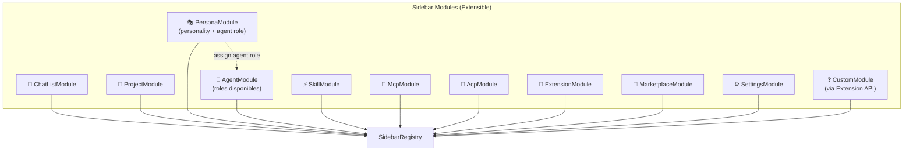

### 5.2 Panel Principal (Main Chat)

- **Message list** — Streaming, markdown render, code highlighting, artifact embeds
- **Input bar** — Textarea con @mentions, slash autocomplete, file attach, voice button
- **Status bar** — Model activo, tokens, approval mode, workspace, agent

### 5.3 Panel Derecho (Side Panel) — Context-Driven

El panel derecho cambia según el contexto (como VS Code):

- **Artifacts Canvas** — Cuando hay artifacts generados
- **ACP Output** — Cuando hay sesión ACP activa
- **Browser Preview** — Cuando se usa `/browse`
- **Diff View** — En modo `/review`
- **Design Canvas** — En modo `/design`
- **Extension Panel** — Cualquier extensión puede registrar un panel

### 5.4 Modularidad Visual

**Toda la UI es modular.** Cada componente visual implementa el trait `UiModule`:

```rust
pub trait UiModule: Send + Sync {
    fn id(&self) -> &str;
    fn display_name(&self) -> &str;
    fn icon(&self) -> &str;  // NF glyph
    fn render_sidebar_section(&self, ctx: &RenderContext) -> Element;
    fn render_panel(&self, ctx: &RenderContext) -> Option<Element>;
    fn status_badge(&self) -> Option<Badge>;
    fn on_activate(&self, ctx: &mut AppContext);
}
```

Las extensiones pueden:
- Registrar nuevas secciones en la sidebar
- Registrar paneles en el panel derecho
- Inyectar botones en la toolbar
- Agregar items al status bar
- Modificar el contexto del input (autocomplete, etc.)

---

## 6. Visual Design System

### 6.1 Design Tokens

```
Colors:
  --bg-primary:    #0d1117     Main background
  --bg-secondary:  #161b22     Sidebar, headers
  --bg-tertiary:   #1c2128     Hover states, sections
  --border:        #30363d     Borders, separators
  --text-primary:  #e6edf3     Main text
  --text-secondary:#8b949e     Secondary text
  --accent:        #58a6ff     Primary accent (blue)
  --accent-dim:    #1f6feb     Accent dark
  --green:         #3fb950     Success, status
  --yellow:        #d29922     Warnings, approval
  --red:           #f85149     Errors, reject
  --purple:        #bc8cff     Personality, plugins
  --orange:        #f0883e     Notifications
  --cyan:          #39d2c0     Info, secondary accent

Typography:
  Font:     JetBrains Mono Nerd Font
  Size:     13px body, 11px UI, 15px headers
  Weight:   400 body, 500 labels, 600 headers

Spacing:   4px base unit (4, 8, 12, 14, 16, 20, 24)
Radii:     3px tags, 6px buttons/cards, 10px inputs/bubbles, 12px badges
```

### 6.2 Matugen Theme Integration

HyprCollab es compatible con **Matugen** — el generador de temas Material You para Linux. Lee el tema activo del sistema y adapta todos los colores de la UI en tiempo real.

**Cómo funciona:**

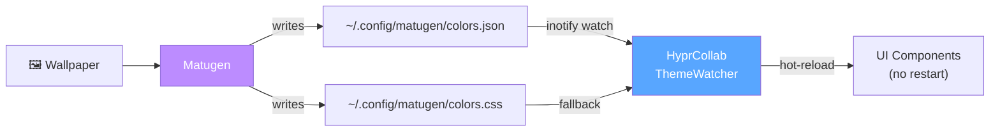

**Matugen colors.json** (auto-generado por Matugen al cambiar wallpaper):
```json
{
  "colors": {
    "background": "#0d1117",
    "surface": "#161b22",
    "primary": "#58a6ff",
    "secondary": "#bc8cff",
    "tertiary": "#39d2c0",
    "error": "#f85149",
    "on_background": "#e6edf3",
    "on_surface": "#8b949e",
    "on_primary": "#0d1117",
    "surface_variant": "#1c2128",
    "outline": "#30363d"
  }
}
```

**Mapping Matugen → HyprCollab tokens:**
```
matugen.background     → --bg-primary
matugen.surface        → --bg-secondary
matugen.surface_variant→ --bg-tertiary
matugen.outline        → --border
matugen.on_background  → --text-primary
matugen.on_surface     → --text-secondary
matugen.primary        → --accent
matugen.primary (dim)  → --accent-dim
matugen.error          → --red
matugen.secondary      → --purple
matugen.tertiary       → --cyan
```

**3 modos de tema:**

1. **Matugen (auto)** — Lee `~/.config/matugen/colors.json`, hot-reload con inotify
2. **Static dark** — Tokens hardcodeados (#0d1117, Catppuccin-like) — default si no hay Matugen
3. **Custom** — Usuario define sus propios colores en `config.lua`

**Config en config.lua:**
```lua
config.theme = {
    mode = "matugen",                    -- "matugen" | "static" | "custom"
    matugen_path = "~/.config/matugen/colors.json",
    static_preset = "catppuccin-mocha",  -- "catppuccin-mocha" | "dracula" | "nord" | "tokyo-night" | "github-dark"
    custom_colors = {                     -- Solo si mode = "custom"
        bg_primary = "#0d1117",
        bg_secondary = "#161b22",
        accent = "#58a6ff",
        -- ... todos los tokens sobre-escribibles
    },
    avatar_tinting = true,               -- Avatar borders siguen el accent color del tema
}
```

**Rust:**
```rust
pub struct ThemeManager {
    mode: ThemeMode,
    tokens: DesignTokens,
    watcher: Option<inotify::InotifyWatch>,
}

pub enum ThemeMode {
    Matugen { path: PathBuf },
    Static { preset: StaticPreset },
    Custom { colors: HashMap<String, String> },
}

impl ThemeManager {
    /// Start watching matugen colors.json for changes
    pub fn start_watcher(&mut self) -> Result<()>;
    
    /// Hot-reload all UI components with new tokens
    pub fn apply_tokens(&self, tokens: &DesignTokens);
    
    /// Map matugen colors → HyprCollab design tokens
    pub fn map_matugen(&self, colors: &MatugenColors) -> DesignTokens;
}
```

**Presets incluidos (static):**
- `catppuccin-mocha` — Mauve accent (#cba6f7), dark (#1e1e2e)
- `dracula` — Purple accent (#bd93f9), dark (#282a36)
- `nord` — Frost blue (#88c0d0), dark (#2e3440)
- `tokyo-night` — Blue accent (#7aa2f7), dark (#1a1b26)
- `github-dark` — Blue accent (#58a6ff), dark (#0d1117) ← default

**Comportamiento:**
- Si Matugen está instalado → modo auto, hot-reload sin restart
- Si no está → static con preset `github-dark`
- Cambio de wallpaper → Matugen genera nuevos colores → HyprCollab detecta → aplica en <100ms
- Todos los componentes UI (sidebar, chat, panels, status bar, avatars) usan los mismos tokens
- Avatar borders y status indicators siguen el accent del tema activo

### 6.3 Layout Structure

```
┌──────────────────────────────────────────────────────────────────┐
│  ┌─────────┐ resize ┌───────────────────────┐ resize ┌────────┐ │
│  │         │ handle │                       │ handle │        │ │
│  │ SIDEBAR │   ◆    │     MAIN CHAT         │   ◆    │ PANEL  │ │
│  │ 260px   │        │      flex-1           │        │ 420px  │ │
│  │         │        │                       │        │        │ │
│  │ 💬 Chats│        │ ┌─── Chat Header ───┐ │        │ Tabs:  │ │
│  │ 🤖Agent │        │ │ model | agent | / │ │        │Artifacts│ │
│  │  🎭pers │        │ └───────────────────┘ │        │  ACP   │ │
│  │ ⚡Skills│        │                       │        │Browser │ │
│  │ 🔌 MCP │        │ ┌─── Messages ──────┐ │        │        │ │
│  │ 📡 ACP │        │ │ User bubble       │ │        │Artifact│ │
│  │ 🧩 Ext │        │ │ Assistant bubble   │ │        │ cards  │ │
│  │ 🏪 Mkt │        │ │  ├ Tool call      │ │        │Mermaid │ │
│  │ ⚙️ Set │        │ │  ├ Code block     │ │        │diagrams│ │
│  │         │        │ │  └ Streaming...│  │ │        │Approval│ │
│  │         │        │ └───────────────────┘ │        │ dialog │ │
│  │         │        │                       │        │        │ │
│  │         │        │ ┌─ Status Bar ──────┐ │        │        │ │
│  │         │        │ │ ● Connected  1.2K │ │        │        │ │
│  │         │        │ └───────────────────┘ │        │        │ │
│  │         │        │ ┌─── Input ─────────┐ │        │        │ │
│  │         │        │ │ pills | textarea  │ │        │        │ │
│  │         │        │ │ 📎 🎙️ /    [▶]   │ │        │        │ │
│  │         │        │ └───────────────────┘ │        │        │ │
│  └─────────┘        └───────────────────────┘        └────────┘ │
└──────────────────────────────────────────────────────────────────┘
```

### 6.4 Sidebar — Personas & Agents Detail

**🎭 Personas** (sección principal):
```
🎭 Personas                                   3  ▼
  ┌─────────────────────────────────────────────────┐
  │ 🎭 Dr. Security              🤖 security-audit │  ← selected
  │    technical · formal · en                       │
  └─────────────────────────────────────────────────┘
  ┌─ 🎭 Persona Detail ─────────────────────────────┐
  │  Name      Dr. Security                         │
  │  Tone      technical                            │
  │  Language  en                                   │
  │  Length     concise                             │
  │  Formality formal                               │
  │  Humor     none                                 │
  │  Plugins   [accessibility-checker]              │
  │  ─────────────────────────────────              │
  │  Agent Role: 🤖 security-auditor     [Change]   │
  │    tools: file_read, web_search, shell          │
  │    approval: strict                             │
  └─────────────────────────────────────────────────┘
  ┌─────────────────────────────────────────────────┐
  │ 🎭 Rusty                      🤖 rust-architect │
  │    friendly · casual · es                        │
  └─────────────────────────────────────────────────┘
  ┌─────────────────────────────────────────────────┐
  │ 🎭 Code Sage                                     │
  │    strict · formal · en        (sin agente)     │
  └─────────────────────────────────────────────────┘
  + New persona
```

**🤖 Agents** (roles disponibles):
```
🤖 Agent Roles                                 4  ▼
  ┌─────────────────────────────────────────────┐
  │ [🔒] security-auditor                       │
  │      tools: file, web, shell                │
  │      approval: strict                       │
  │      assigned to: Dr. Security              │
  └─────────────────────────────────────────────┘
  ┌─────────────────────────────────────────────┐
  │ [🏗️] rust-architect                         │
  │      tools: file, shell, cargo              │
  │      approval: normal                       │
  │      assigned to: Rusty                     │
  └─────────────────────────────────────────────┘
  ┌─────────────────────────────────────────────┐
  │ [🔍] code-reviewer                          │
  │      tools: file, web                       │
  │      approval: normal                       │
  │      (unassigned)                           │
  └─────────────────────────────────────────────┘
  ┌─────────────────────────────────────────────┐
  │ [🐳] devops-helper                          │
  │      tools: shell, docker, k8s              │
  │      approval: permissive                   │
  │      (unassigned)                           │
  └─────────────────────────────────────────────┘
  + New agent role
```

### 6.5 Chat Message Styles

**Assistant message:**
```
┌─────────────────────────────────────────────────────┐
│ [img] │  Running security audit on hyprcollab-lua... │
│ Dr.S  │                                             │
│       │  ┌─ 📋 file_read ──────────── ✓ 247 lines ─┐│
│       │  │ Reading sandbox.rs                       ││
│       │  └──────────────────────────────────────────┘│
│       │                                             │
│       │  ┌─ Rust ────────────────────────── Copy ──┐│
│       │  │ fn whitelist_popen(cmd: &str) -> bool {  ││
│       │  │     cmd.starts_with("git ")              ││
│       │  │ }                                         ││
│       │  └──────────────────────────────────────────┘│
│       │                                             │
│       │  **Findings:** 1. ✅ safe  2. ⚠️ medium█    │
└─────────────────────────────────────────────────────┘
                                                  ^cursor

  [img] = Persona avatar (imagen 40x40, o emoji fallback)
  Dr.S  = Persona name (truncado)
```

**User message (right-aligned):**
```
                              ┌──────────────────────────┐
                              │ Review the Lua sandbox   │
                              │ for escape vectors       │
                              └─────── [img] Hans ──────┘

  [img] = User avatar (imagen 40x40, o initials fallback)
  Hans  = User display name
```

### 6.6 Input Area Detail

```
┌──────────────────────────────────────────────────────┐
│ [🤖 security-auditor] [claude-sonnet-4] [🎭 tech]    │  ← context pills
├──────────────────────────────────────────────────────┤
│ Apply the io.popen fix and add a regression test     │  ← textarea
├──────────────────────────────────────────────────────┤
│ 📎  🎙️  /                                       [▶]  │  ← toolbar
└──────────────────────────────────────────────────────┘
```

### 6.7 Panel Derecho — Artifacts

```
┌────────────────────────────────────────┐
│  Artifacts  │  ACP  │  Browser         │  ← tabs
├────────────────────────────────────────┤
│  ┌── [Rust] sandbox.rs ──────── 📋 📥┐│
│  │ fn whitelist_popen(cmd: &str)...   ││
│  └────────────────────────────────────┘│
│                                        │
│  ┌── [Mermaid] Config Flow ────── ⛶ ─┐│
│  │                                     ││
│  │  Global → Folder → Agent → ✅      ││
│  │                                     ││
│  └────────────────────────────────────┘│
│                                        │
│  ┌── ⚠️ Approval Required ───────────┐│
│  │ $ cargo test --lib hyprcollab_lua  ││
│  │ [✓ Approve] [✗ Reject] [Always]   ││
│  └────────────────────────────────────┘│
└────────────────────────────────────────┘
```

### 6.8 Status Bar

```
● Connected │ Tokens: 1,247/200k │ Approval: normal │ ~/hyprcollab │ ~150MB
```

### 6.9 Full Mockup Reference

A complete interactive HTML mockup is available at:
`/tmp/HyprCollab-UI-Design.html` — open in any browser for the full visual design.

---

## 7. LLM Engine — Native + API + GGUF

HyprCollab soporta **3 modos de ejecución LLM** sin necesidad de apps intermediarias:

```mermaid
graph TB
    subgraph "HyprCollab LLM Engine"
        ROUTER["LlmRouter"]
    end
    
    subgraph "Mode 1: Native GGUF"
        LLAMA["llama.cpp.rs<br/>(bindgen)"]
        GGUF_MODELS["model.gguf<br/>(local files)"]
        CANDLE["candle<br/>(pure Rust)"]
    end
    
    subgraph "Mode 2: API Cloud"
        OPENAI["OpenAI<br/>GPT-4o / o3"]
        ANTHROPIC["Anthropic<br/>Claude Sonnet/Opus"]
        GEMINI["Google<br/>Gemini 2.5"]
        XAI["xAI<br/>Grok"]
        DEEPSEEK["DeepSeek<br/>V3 / R1"]
    end
    
    subgraph "Mode 3: Local Server"
        OLLAMA["Ollama<br/>(GGUF auto)"]
        LMD["lmstudio<br/>(OpenAI-compat)"]
        VLLM["vLLM<br/>(OpenAI-compat)"]
        CUSTOM_API["Custom URL<br/>(OpenAI-compat)"]
    end
    
    subgraph "Mode 4: Extension"
        EXT_LLM["Custom Provider<br/>(Extension API)"]
    end
    
    ROUTER --> LLAMA
    ROUTER --> CANDLE
    ROUTER --> GGUF_MODELS
    ROUTER --> OPENAI
    ROUTER --> ANTHROPIC
    ROUTER --> GEMINI
    ROUTER --> XAI
    ROUTER --> DEEPSEEK
    ROUTER --> OLLAMA
    ROUTER --> LMD
    ROUTER --> VLLM
    ROUTER --> CUSTOM_API
    ROUTER --> EXT_LLM
    
    style ROUTER fill:#1f6feb,color:#fff
    style LLAMA fill:#238636,color:#fff
    style OPENAI fill:#f0883e,color:#fff
    style OLLAMA fill:#bc8cff,color:#fff
```

### 7.1 Modo 1: Native GGUF (Zero Dependencies)

**Ejecución directa de modelos .gguf sin Ollama, sin Python, sin nada externo.**

```lua
-- config.lua
config.llm.native = {
    enabled = true,
    
    -- Backend: "llama-cpp" (bindgen) o "candle" (pure Rust)
    backend = "llama-cpp",
    
    -- Model registry — modelos descargados localmente
    models = {
        {
            name = "llama-3.3-70b",
            path = "~/.local/share/hyprcollab/models/llama-3.3-70b-instruct-Q4_K_M.gguf",
            context_length = 8192,
            gpu_layers = 99,         -- -1 = all to GPU, 0 = CPU only
            threads = 8,
        },
        {
            name = "qwen3-32b",
            path = "~/.local/share/hyprcollab/models/qwen3-32b-Q5_K_M.gguf",
            context_length = 32768,
            gpu_layers = 99,
        },
        {
            name = "gemma3-12b",
            path = "~/.local/share/hyprcollab/models/gemma-3-12b-it-Q4_K_M.gguf",
            context_length = 8192,
            gpu_layers = 99,
        },
        {
            name = "phi-4-mini",
            path = "~/.local/share/hyprcollab/models/phi-4-mini-instruct-Q8_0.gguf",
            context_length = 16384,
            gpu_layers = 0,           -- CPU only (lightweight)
            threads = 4,
        },
    },
    
    -- Auto-download from HuggingFace
    auto_download = {
        enabled = true,
        directory = "~/.local/share/hyprcollab/models/",
        hf_mirror = nil,             -- nil = default, or "https://hf-mirror.com"
    },
    
    -- Default native model
    default = "llama-3.3-70b",
}
```

**Backends nativos:**

 Backend | Tipo | GPU | Ventaja |
---------|------|-----|---------|
 `llama.cpp` (bindgen) | C bindings | CUDA/Metal/Vulkan | Máximo rendimiento, todos los quant |
 `candle` | Pure Rust | CUDA/Metal | Sin C deps, compilación simple |
 `mistral.rs` | Rust bindings | CUDA/Metal/Flash Attn | ISQ quant,速度快 |

**Flujo de uso:**
1. `/model native/llama-3.3-70b` → carga modelo desde disco
2. Si no existe → auto-download desde HuggingFace con barra de progreso
3. Modelo se mantiene en memoria mientras está activo
4. Multiple modelos pueden coexistir (RAM/GPU permitting)
5. Hot-swap: cambiar modelo sin reiniciar la app

**Descarga de modelos:**
```
/model download NousResearch/Llama-3.3-70B-Instruct-GGUF Q4_K_M
→ Downloading from HuggingFace... [██████████] 42GB / 42GB
→ Saved to ~/.local/share/hyprcollab/models/Llama-3.3-70B-Instruct-Q4_K_M.gguf
→ Ready to use: /model native/llama-3.3-70b
```

### 7.2 Modo 2: Cloud APIs

```lua
config.llm.api = {
    providers = {
        openai = {
            type = "openai",
            api_key = os.getenv("OPENAI_API_KEY"),
            models = { "gpt-4o", "gpt-4o-mini", "o3", "o3-mini", "o4-mini" },
            default = "gpt-4o",
        },
        anthropic = {
            type = "anthropic",
            api_key = os.getenv("ANTHROPIC_API_KEY"),
            models = { "claude-sonnet-4-20250514", "claude-opus-4-20250514" },
            default = "claude-sonnet-4-20250514",
        },
        google = {
            type = "openai-compatible",     -- Gemini via OpenAI-compat endpoint
            base_url = "https://generativelanguage.googleapis.com/v1beta/openai/",
            api_key = os.getenv("GOOGLE_API_KEY"),
            models = { "gemini-2.5-pro", "gemini-2.5-flash" },
            default = "gemini-2.5-pro",
        },
        xai = {
            type = "openai-compatible",
            base_url = "https://api.x.ai/v1",
            api_key = os.getenv("XAI_API_KEY"),
            models = { "grok-3", "grok-3-mini" },
        },
        deepseek = {
            type = "openai-compatible",
            base_url = "https://api.deepseek.com/v1",
            api_key = os.getenv("DEEPSEEK_API_KEY"),
            models = { "deepseek-chat", "deepseek-reasoner" },
        },
        openrouter = {
            type = "openai-compatible",
            base_url = "https://openrouter.ai/api/v1",
            api_key = os.getenv("OPENROUTER_API_KEY"),
            models = { "auto" },            -- all models available
        },
    },
}
```

### 7.3 Modo 3: Local Servers (OpenAI-Compatible)

Cualquier servidor que exponga API OpenAI-compatible funciona sin config extra:

```lua
config.llm.local = {
    providers = {
        ollama = {
            type = "openai-compatible",
            base_url = "http://localhost:11434/v1",
            api_key = "ollama",              -- Ollama no necesita key real
            models = "auto",                 -- Auto-discover via /api/tags
            auto_start = true,               -- Intentar iniciar Ollama si no corre
            keep_alive = "5m",               -- Modelo en memoria 5min después de uso
        },
        lmstudio = {
            type = "openai-compatible",
            base_url = "http://localhost:1234/v1",
            api_key = "lmstudio",
            models = "auto",                 -- Auto-discover via /v1/models
        },
        vllm = {
            type = "openai-compatible",
            base_url = "http://localhost:8000/v1",
            api_key = "none",
            models = "auto",
        },
        custom = {
            -- Cualquier URL OpenAI-compatible
            type = "openai-compatible",
            base_url = os.getenv("CUSTOM_LLM_URL") or "http://localhost:8080/v1",
            api_key = os.getenv("CUSTOM_LLM_KEY") or "",
            models = { "my-model" },
        },
    },
}
```

### 7.4 Model Management

```lua
config.llm.defaults = {
    -- Modelo default global
    default_provider = "anthropic",
    default_model = "claude-sonnet-4-20250514",
    
    -- Fallback chain: si el default falla, prueba estos en orden
    fallback_chain = { "openai/gpt-4o", "ollama/llama3.3", "native/llama-3.3-70b" },
    
    -- Per-agent model override (en agent.md)
    -- model: "native/phi-4-mini"
    -- O por task:
    -- coding_model: "anthropic/claude-sonnet-4"
    -- review_model: "openai/o3"
    -- chat_model: "native/llama-3.3-70b"
    
    -- Default params
    temperature = 0.7,
    max_tokens = 8192,
    top_p = 1.0,
    
    -- Streaming
    stream = true,
    
    -- Cost tracking
    track_cost = true,
    warn_cost_usd = 1.0,            -- Alertar si gasto > $1 por conversación
    
    -- Rate limiting
    rate_limit_rpm = 60,            -- Requests por minuto
    rate_limit_tpm = 100000,        -- Tokens por minuto
}
```

### 7.5 Slash Commands

- `/model` — Mostrar modelo actual
- `/model anthropic/claude-sonnet-4` — Cambiar modelo
- `/model native/llama-3.3-70b` — Usar modelo local GGUF
- `/model ollama/qwen3:32b` — Usar modelo via Ollama
- `/model list` — Listar todos los modelos disponibles (nativos + API + locales)
- `/model download NousResearch/Llama-3.3-70B-Instruct-GGUF Q4_K_M` — Descargar GGUF
- `/model status` — GPU/CPU usage, modelos cargados en memoria
- `/model compare <m1> <m2> <prompt>` — Comparar respuestas lado a lado

### 7.6 Rust API — LlmProvider Trait

```rust
pub enum ProviderType {
    Native,          // GGUF via llama.cpp/candle
    ApiCloud,        // OpenAI, Anthropic, etc.
    ApiLocal,        // Ollama, vLLM, lmstudio, custom URL
    Extension,       // Via extension plugin
}

#[async_trait]
pub trait LlmProvider: Send + Sync {
    fn id(&self) -> &str;
    fn provider_type(&self) -> ProviderType;
    fn available_models(&self) -> Vec<ModelInfo>;
    fn is_available(&self) -> bool;
    
    async fn chat_completion(&self, req: ChatRequest) -> Result<ChatResponse>;
    async fn chat_stream(&self, req: ChatRequest) -> Result<Pin<Box<dyn Stream<Item = Result<TokenChunk>> + Send>>>;
    async fn embed(&self, text: &str) -> Result<Vec<f32>>;
    
    // Native-only methods
    fn load_model(&mut self, path: &str, config: ModelConfig) -> Result<()>;
    fn unload_model(&mut self) -> Result<()>;
    fn model_status(&self) -> ModelStatus;
    fn vram_usage(&self) -> Option<VramInfo>;
}

pub struct LlmRouter {
    providers: HashMap<String, Box<dyn LlmProvider>>,
    default: String,
    fallback: Vec<String>,
}

impl LlmRouter {
    pub async fn chat(&self, req: ChatRequest) -> Result<ChatResponse>;
    pub async fn chat_stream(&self, req: ChatRequest) -> Result<Pin<Box<dyn Stream<Item = Result<TokenChunk>> + Send>>>;
    pub fn register(&mut self, provider: Box<dyn LlmProvider>);
    pub fn list_all_models(&self) -> Vec<(String, ModelInfo)>;
    pub fn resolve(&self, model_str: &str) -> Result<&dyn LlmProvider>;
}
```

### 7.7 Native GGUF Provider — Internals

```rust
// hyprcollab-provider-native/src/lib.rs
pub struct NativeProvider {
    backend: NativeBackend,
    loaded_model: Option<LoadedModel>,
    config: NativeConfig,
}

enum NativeBackend {
    LlamaCpp(llama_cpp::LlamaModel),   // bindgen to llama.cpp
    Candle(candle::Model),              // pure Rust
    MistralRs(mistralrs::Model),        // mistral.rs bindings
}

impl NativeProvider {
    /// Load GGUF from disk into GPU/CPU memory
    pub fn load_gguf(&mut self, path: &Path, config: &ModelConfig) -> Result<()> {
        // Detect quantization from GGUF header
        // Allocate GPU layers based on config.gpu_layers
        // Warm up with empty prompt
    }
    
    /// Download model from HuggingFace
    pub async fn download(&self, repo: &str, filename: &str) -> Result<PathBuf> {
        // hf_hub::api::sync::Api::new().model(repo).download(filename)
        // Progress callback for UI
    }
    
    /// List available local models
    pub fn list_local_models(&self) -> Vec<ModelInfo> {
        // Scan ~/.local/share/hyprcollab/models/*.gguf
        // Parse GGUF metadata (name, context_length, quantization)
    }
}
```

---

## 8. Features

### P0 — MVP (Mes 1-3)

- **Chat con streaming** — Respuestas token-a-token vía SSE
- **Multi-provider LLM** — Native GGUF (llama.cpp/candle), OpenAI, Anthropic, Google, xAI, DeepSeek, Ollama, vLLM, OpenAI-compatible, Extension
- **Terminal aesthetic UI** — Dark #0d1117, JetBrainsMono NF, glifos NF
- **Artifacts Canvas** — Panel lateral con preview de código, markdown, SVG, Mermaid, React
- **Tool calls visibles** — Mostrar reasoning steps y tool execution inline
- **RAG pipeline** — Upload docs → embeddings → query con contexto
- **Agent system** — Agente con tools (shell, web, files), loops multi-step
- **Memoria persistente** — SQLite: conversaciones, preferencias, contexto cruzado
- **Config YAML** — ~/config/hyprcollab/config.yaml
- **MCP Client** — Conexión a servidores MCP externos
- **Slash commands básicos** — `/agent`, `/skill`, `/mcp`, `/model`, `/workspace`
- **Aprobación de ejecuciones** — Human-in-the-loop para tools peligrosas

### P1 — v1.1 (Mes 4-6)

- **Desktop app (Tauri)** — App nativa Linux/macOS/Windows
- **TUI mode** — Interfaz ratatui con kitty image preview
- **Workspaces** — Separación de contexto por proyecto
- **Skills system** — Skills YAML instalables con auto-learning
- **ACP Output viz** — Visualización de sesiones ACP (Claude Code, Codex, AGY)
- **Multi-agent** — Delegación a subagentes con contexto aislado
- **Voice I/O** — Whisper STT + TTS edge/elevenlabs
- **Code interpreter** — Sandbox (Docker/Wasmtime) para ejecución
- **Navegación web nativa** — Headless browser embebido
- **Inline artifacts** — Artefactos embebidos en el chat (no solo panel lateral)
- **Conversation branching** — Fork desde cualquier mensaje
- **Temas** — Terminal-dark, Catppuccin, Nord, Dracula, Tokyo Night

### P2 — v2.0 (Mes 7-12)

- **Mobile** — Tauri 2.0 mobile + PWA completa
- **Multi-user** — Auth, roles, shared workspaces
- **Cron/Scheduler** — Tareas programadas con output al chat
- **Collaborative canvas** — Edición simultánea humano+IA
- **Multi-model compare** — Enviar mismo prompt a N modelos lado a lado
- **Export** — Markdown, JSON, PDF, PNG
- **Prompt templates** — Library de prompts reusables con variables
- **i18n** — Multi-idioma (ES, EN, JA, ZH)
- **Observability** — Tracing, metrics, token usage dashboard
- **WASM plugins** — Sistema de plugins cargables en runtime
- **Search avanzado** — FTS5 full-text search + semantic search
- **Bookmarks + Pinned** — Marcar mensajes y fijar conversaciones

---

## 9. Slash Commands Agénticos

Sistema extensible de comandos que cargan configuración desde archivos `.md`:

- `/agent <name>` — Carga `~/config/hyprcollab/agents/<name>.md` con system prompt, tools, config del agente
- `/skill <name>` — Carga `~/config/hyprcollab/skills/<name>.md` con procedimiento y steps
- `/mcp <server>` — Conecta/desconecta servidor MCP
- `/acp <connector>` — Inicia sesión ACP (claude-code, codex, agy)
- `/design` — Carga `design.md` y entra en modo diseño (canvas colaborativo)
- `/review` — Carga `review.md` y entra en modo code review
- `/run <command>` — Ejecuta comando del sistema (con aprobación previa si aplica)
- `/browse <url>` — Abre navegador web nativo embebido
- `/model <provider/model>` — Cambia modelo en runtime
- `/workspace <name>` — Cambia workspace activo
- `/theme <name>` — Cambia tema visual
- `/export <format>` — Exporta conversación (md, json, pdf)
- `/compare` — Compara dos modelos lado a lado
- `/bookmark` — Marca mensaje actual
- `/help` — Lista todos los comandos disponibles

Cada command carga su `.md` correspondiente. Los archivos tienen formato frontmatter YAML + markdown body con instrucciones.

---

## 10. Kitty Image Protocol (TUI Mode)

Cuando HyprCollab se ejecuta como TUI en terminal:

- **Detección automática:** Check kitty graphics protocol support via escape sequences, fallback a Sixel
- **Preview de imágenes:** PNG, JPG, JPEG, WebP, BMP renderizados inline en terminal
- **Preview de SVG:** Renderizado via resvg a PNG temporal, luego mostrado
- **Preview de código:** Syntax highlighted via syntect con tema Catppuccin
- **Preview de PDF:** Primera página renderizada como imagen
- **Preview de Markdown:** Renderizado a HTML temporal → screenshot → mostrado
- **Artifact canvas:** En TUI, los artifacts se previsualizan inline usando el protocolo
- **Controls:** Click para zoom, scroll para navegar páginas en PDF

---

## 11. Image Generation — Multi-Backend

HyprCollab incluye un sistema de generación de imágenes agéntico con múltiples backends:

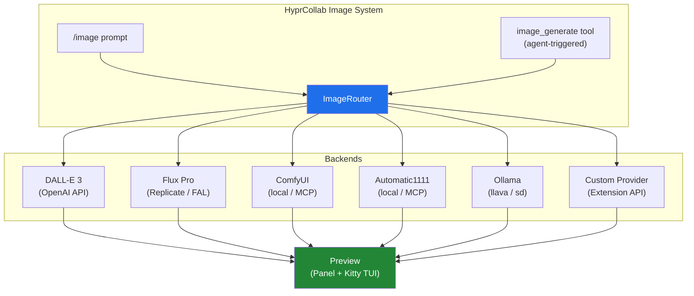

### 8.1 Backends Soportados

**Cloud APIs (zero setup):**
- **DALL-E 3** — OpenAI API. Calidad alta, resolución hasta 1792×1024
- **Flux Pro/Dev/Schnell** — Via Replicate, FAL, o API directa
- **Stability AI** — Stable Diffusion 3, Stable Cascade
- **Midjourney** — Via API proxy (GoAPI, etc.)

**Local / Self-hosted (GPU):**
- **ComfyUI** — Workflows completos con nodos. Acceso via API REST o MCP server
- **Automatic1111** — Stable Diffusion WebUI. Acceso via API REST o MCP server
- **Forge** — Fork optimizado de A1111
- **Ollama** — Modelos de imagen locales (si disponibles)

**Extension API:**
- Cualquier extension puede registrar un nuevo `ImageProvider` via trait

### 8.2 Config (config.lua)

```lua
config.image = {
    -- Default backend
    default = "dalle3",
    
    -- Backends configuration
    providers = {
        dalle3 = {
            type = "api",
            api_key = os.getenv("OPENAI_API_KEY"),
            model = "dall-e-3",
            quality = "hd",           -- standard, hd
            style = "natural",         -- vivid, natural
            sizes = { "1024x1024", "1792x1024", "1024x1792" },
        },
        flux = {
            type = "api",
            provider = "fal",          -- fal, replicate, direct
            api_key = os.getenv("FAL_KEY"),
            model = "flux-pro",
        },
        comfyui = {
            type = "local",
            base_url = "http://127.0.0.1:8188",
            workflow = "default",      -- ComfyUI workflow JSON name
            -- O via MCP:
            -- type = "mcp",
            -- mcp_server = "comfyui",
        },
        automatic1111 = {
            type = "local",
            base_url = "http://127.0.0.1:7860",
            model = "sdXL_v10",
            sampler = "DPM++ 2M Karras",
            steps = 30,
            cfg_scale = 7,
            -- O via MCP:
            -- type = "mcp",
            -- mcp_server = "a1111",
        },
        ollama_img = {
            type = "local",
            base_url = "http://localhost:11434",
            model = "llava",
        },
    },
    
    -- Defaults for all providers
    defaults = {
        width = 1024,
        height = 1024,
        negative_prompt = "",
        seed = nil,           -- nil = random
        batch_size = 1,
        save_to = "~/Imágenes/hyprcollab/",
        format = "png",
    },
}
```

### 8.3 Slash Commands

- `/image <prompt>` — Generar imagen con el backend default
- `/image dalle3 <prompt>` — Usar backend específico
- `/image comfyui <workflow> <prompt>` — ComfyUI con workflow custom
- `/image a1111 --model sdXL --steps 50 <prompt>` — Con parámetros
- `/image upscale <path>` — Upscale de imagen existente
- `/image vary <path>` — Crear variación
- `/image providers` — Listar backends configurados y status
- `/image history` — Historial de imágenes generadas

### 8.4 Agent Tool: `image_generate`

El agente puede generar imágenes como parte de su workflow:

```rust
pub struct ImageGenerateTool;

impl Tool for ImageGenerateTool {
    fn name(&self) -> &str { "image_generate" }
    fn description(&self) -> &str {
        "Generate images from text prompts. Supports multiple backends."
    }
    
    async fn execute(&self, input: ImageGenInput) -> Result<ImageGenOutput> {
        // Input: prompt, backend (optional), width, height, negative_prompt, etc.
        // Output: image path, preview URL, metadata
    }
}

pub struct ImageGenInput {
    pub prompt: String,
    pub backend: Option<String>,        // Override default
    pub width: Option<u32>,
    pub height: Option<u32>,
    pub negative_prompt: Option<String>,
    pub style: Option<String>,
    pub seed: Option<u64>,
    pub workflow: Option<String>,       // ComfyUI workflow name
    pub model: Option<String>,          // Override model
}

pub struct ImageGenOutput {
    pub path: String,                   // Local file path
    pub url: Option<String>,            // URL if cloud
    pub width: u32,
    pub height: u32,
    pub backend: String,
    pub seed: u64,
    pub generation_time_ms: u64,
}
```

### 8.5 Image Provider Trait (Extensible)

```rust
pub trait ImageProvider: Send + Sync {
    fn id(&self) -> &str;
    fn name(&self) -> &str;
    fn provider_type(&self) -> ProviderType;  // Api, Local, Mcp
    fn is_available(&self) -> bool;
    async fn generate(&self, input: &ImageGenInput) -> Result<ImageGenOutput>;
    async fn upscale(&self, image: &[u8], scale: f32) -> Result<Vec<u8>>;
    async fn vary(&self, image: &[u8], prompt: &str) -> Result<ImageGenOutput>;
}
```

### 8.6 Preview & Display

Las imágenes generadas se muestran:
- **Desktop/Web:** Inline en el chat + panel derecho con zoom
- **TUI:** Kitty image protocol / Sixel inline en terminal
- **Mobile:** En card con zoom pinch-to-zoom
- **Artifact:** Se guarda como artifact del chat (reutilizable, exportable)

### 8.7 ComfyUI Integration Detalle

ComfyUI es el backend más poderoso para generación local:

```lua
-- config.lua — ComfyUI config detallada
config.image.providers.comfyui = {
    type = "mcp",                       -- Via MCP server (recomendado)
    mcp_server = "comfyui",             -- MCP server name
    
    -- O via API directa:
    -- type = "local",
    -- base_url = "http://127.0.0.1:8188",
    
    -- Workflows predefinidos
    workflows = {
        default = "~/.config/hyprcollab/comfyui/default.json",
        anime = "~/.config/hyprcollab/comfyui/anime.json",
        photoreal = "~/.config/hyprcollab/comfyui/photoreal.json",
        inpaint = "~/.config/hyprcollab/comfyui/inpaint.json",
    },
    
    -- Auto-connect on startup
    auto_connect = false,
}
```

**Operaciones ComfyUI via agente:**
- Generar imagen con workflow específico
- Modificar nodos del workflow (cambiar model, prompt, steps)
- Inpainting / Outpainting
- Img2Img
- ControlNet
- LoRA loading

### 8.8 Automatic1111 Integration Detalle

```lua
config.image.providers.automatic1111 = {
    type = "mcp",                       -- Via MCP server
    mcp_server = "a1111",
    
    -- O via API directa:
    -- type = "local",
    -- base_url = "http://127.0.0.1:7860",
    
    model = "sdXL_v10.safetensors",
    vae = "sdxl_vae.safetensors",
    sampler = "DPM++ 2M Karras",
    steps = 30,
    cfg_scale = 7,
    loras = {},                         -- { name, weight }
    
    -- API endpoints:
    -- /sdapi/v1/txt2img
    -- /sdapi/v1/img2img
    -- /sdapi/v1/extra-single-image (upscale)
    -- /sdapi/v1/png-info
}
```

---

## 12. Browser Engine & Web Scraping — Playwright

Navegación web nativa con Playwright + scraping integrado:

- **Modo headless:** Scraping, JS execution, screenshots para tools del agente
- **Modo visual:** En desktop/Tauri, renderizado completo en canvas panel
- **Modo Browse** — Panel derecho muestra preview en vivo, agente interactúa con páginas via tool calls

**Agent Tools:**
- `web_navigate(url)` — Navega a URL, devuelve PageSnapshot
- `web_screenshot()` — Captura screenshot de la página actual
- `web_extract(selector)` — Extrae contenido por CSS selector o XPath
- `web_interact(action, target)` — Click, type, scroll, submit
- `web_js_execute(code)` — Ejecuta JavaScript sandboxed
- `web_scrape(url, selectors)` — **Scraping dedicado:** Extrae datos estructurados de una página usando CSS/XPath selectors. Devuelve JSON. Stealth mode automático
- `web_fill(selector, value)` — Llena campos de formularios
- `web_wait(selector)` — Espera a que aparezca un elemento
- **Cookie/session management:** Persistente entre sesiones
- **RAG auto-indexing:** Opción de auto-indexar páginas visitadas al workspace

**Arquitectura Playwright:**
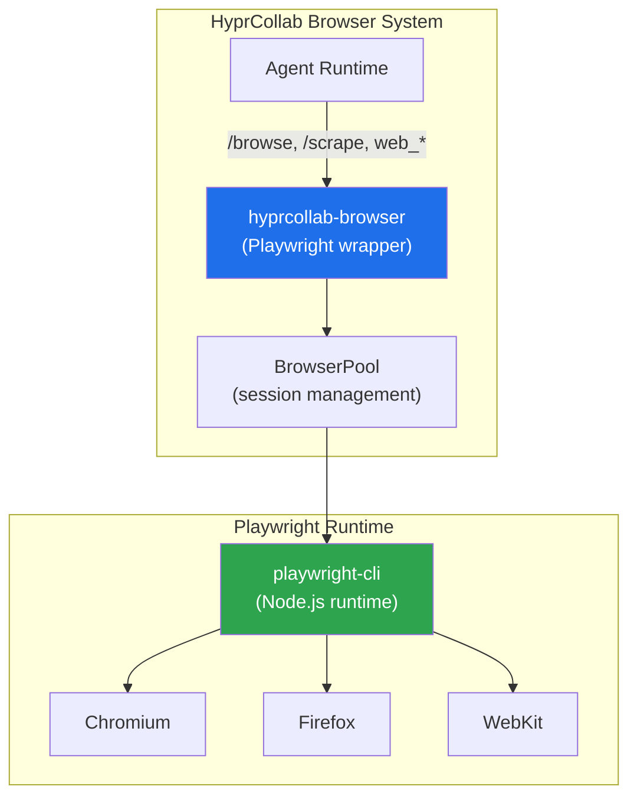

**Features Playwright:**
- **Multi-browser:** Chromium, Firefox, WebKit (Playwright maneja instalación)
- **Session pooling:** Múltiples browser contexts reutilizables, aislados por chat
- **Screenshot capture:** Preview en panel derecho (PNG/JPEG), actualización en vivo
- **JS execution:** El agente ejecuta JavaScript en páginas para extraer datos
- **Form interaction:** Auto-fill, click, scroll, wait para flows complejos
- **Web Scraping:** Extracción de datos con CSS selectors, XPath, JSON output. Stealth mode anti-detección
- **PDF export:** Generar PDFs de páginas visitadas
- **Network intercept:** Log requests/responses para debugging del agente
- **Auth handling:** Cookies, localStorage, sesiones persistentes por contexto
- **Mobile emulation:** Viewport personalizable (desktop, mobile, tablet)
- **Stealth mode:** Headers anti-detección, fingerprint rotation para scraping sin bloqueos

**Rust API (hyprcollab-browser):**
```rust
pub struct PlaywrightDriver {
    pool: BrowserPool,
    default_engine: Engine, // Chromium, Firefox, WebKit
}

impl PlaywrightDriver {
    pub async fn new_page(&self, url: &str) -> Result<Page>;
    pub async fn screenshot(&self, page: &Page) -> Result<Vec<u8>>;
    pub async fn evaluate(&self, page: &Page, js: &str) -> Result<serde_json::Value>;
    pub async fn click(&self, page: &Page, selector: &str) -> Result<()>;
    pub async fn fill(&self, page: &Page, selector: &str, value: &str) -> Result<()>;
    pub async fn content(&self, page: &Page) -> Result<String>;
    pub async fn pdf(&self, page: &Page) -> Result<Vec<u8>>;
    pub async fn wait_for(&self, page: &Page, selector: &str) -> Result<()>;
    pub async fn scrape(&self, page: &Page, selectors: &ScrapeConfig) -> Result<serde_json::Value>;
}
```

**Config (config.lua):**
```lua
config.browser = {
    engine = "chromium",          -- chromium, firefox, webkit
    headless = true,
    viewport = { width = 1280, height = 720 },
    timeout = 30,
    stealth = true,
    block_images = false,          -- true = faster, less bandwidth
    user_agent = nil,              -- nil = default
    proxy = nil,                   -- "http://proxy:port"
    screenshot_format = "png",     -- png, jpeg
    screenshot_quality = 80,       -- jpeg only
    scrape = {
        max_pages = 10,            -- pagination limit
        rate_limit = 1.0,          -- seconds between requests
        output_format = "json",    -- json, csv, markdown
    },
}
```

**Slash commands:**
- `/browse <url>` — Abre URL en el panel derecho con preview
- `/browse screenshot` — Captura screenshot de la página actual
- `/browse click <selector>` — Click en elemento
- `/browse fill <selector> <value>` — Llenar campo
- `/browse js <code>` — Ejecutar JavaScript
- `/browse pdf` — Exportar página como PDF
- `/browse close` — Cerrar sesión de browser
- `/scrape <url> [selectors]` — Scrapea URL y devuelve datos estructurados

---

## 13. Ejecución de Comandos del Sistema

Shell tool mejorado con capacidades avanzadas:

- **Multi-shell:** Detecta bash, fish, zsh automáticamente
- **Working directory:** CWD persiste entre comandos (tracking continuo)
- **Environment variables:** Set/get/unset con persistencia opcional
- **Long-running processes:** Output streaming en tiempo real
- **Background processes:** Start, stop, check status, get output
- **PTY allocation:** Para comandos interactivos (vim-style editors, REPLs)
- **Timeout configurable:** Por comando, con kill automático
- **Output capture:** Stdout + stderr separados, con encoding detection

---

## 14. Approval System

Sistema human-in-the-loop configurable:

- **Reglas por tool:** Cada tool puede configurarse como auto-approve o requires-approval
- **Pattern matching:** Regex sobre el comando/acción para auto-approve específico
- **Scope:** Reglas por workspace, global, o por agente
- **UI de aprobación:** Muestra comando completo, diff si es archivo, contexto
- **Acciones:** Approve, Deny, Modify (editar comando antes de ejecutar)
- **Timeout:** Si el usuario no responde en X segundos, deny automáticamente
- **Bulk approval:** Para operaciones batch (ej: "approve all file reads")
- **Log persistente:** Todas las decisiones se registran en SQLite para auditoría
- **Config ejemplo:**
  - `ask_before: ["shell", "file_write", "web_interact"]`
  - `auto_approve_patterns: ["git status", "ls *", "cat *.md"]`
  - `approval_timeout: 300` (5 minutos)

---

## 15. Funciones Extra

Funcionalidades inspiradas en ChatGPT, OpenClaw, LobeChat, Open WebUI:

- **Branching:** Fork desde cualquier mensaje, explorar ramas sin perder el hilo original
- **Inline artifacts:** Artefactos embebidos directamente en el chat (no solo panel lateral)
- **Voice mode:** Push-to-talk con Whisper STT + TTS, modo hands-free
- **Export:** Conversaciones a Markdown, JSON, PDF, PNG (screenshot)
- **Temas:** Terminal-dark (default), Catppuccin, Nord, Dracula, Tokyo Night, custom CSS
- **Keyboard-first:** Vim-like keybinds (j/k, :wq, gg/G), shortcuts personalizables
- **Session persistence:** Reabrir exactamente donde se dejó (scroll position, open panels)
- **Token tracking:** Dashboard de consumo por modelo, día, workspace, conversación
- **Prompt templates:** Library con variables `${variable}`, compartibles
- **Multi-model compare:** Mismo prompt a N modelos, respuestas lado a lado
- **Diff view:** Comparar dos respuestas del mismo modelo o de modelos distintos
- **Full-text search:** FTS5 sobre todas las conversaciones con ranking
- **Bookmarks:** Marcar mensajes importantes para acceso rápido
- **Pinned conversations:** Fijar chats frecuentes arriba en sidebar
- **Drag & drop:** Subir archivos, imágenes directamente al chat
- **Code block actions:** Copy, download, open in editor, run en code interpreter

---

## 16. User Stories

**Chat Agéntico:**
> "Como desarrollador, quiero chatear con un agente que use herramientas (shell, web, archivos) y vea cada paso de su razonamiento en tiempo real, con aprobación manual para comandos peligrosos."

**Artifacts Multi-plataforma:**
> "Como usuario, quiero que el agente genere código, documentos y visualizaciones en un canvas — visible como panel en desktop, inline en TUI, y responsive en mobile."

**Slash Commands:**
> "Como usuario avanzado, quiero escribir `/agent security-auditor` y que el agente cargue su configuración desde agent.md, cambiando system prompt, tools disponibles y reglas de aprobación."

**Kitty Preview:**
> "Como usuario de terminal, quiero ver previews de imágenes generadas por el agente directamente en mi terminal kitty, sin abrir otra aplicación."

**Aprobación:**
> "Como desarrollador, quiero que el agente me pida confirmación antes de ejecutar `rm -rf` o escribir archivos en producción, con opción de modificar el comando antes de aprobar."

**Web Nativa:**
> "Como usuario, quiero pedirle al agente que navegue una web, extraiga datos y los indexe en RAG — todo sin plugins externos, directamente desde el chat."

**RAG:**
> "Como usuario, quiero subir documentos a un workspace y hacer preguntas con contexto del contenido, sin enviar datos a terceros."

**ACP Visualization:**
> "Como desarrollador, quiero conectar Claude Code o Codex y ver sus outputs formateados en mi interfaz, desde cualquier plataforma."

**Memoria:**
> "Como usuario recurrente, quiero que el agente recuerde mis preferencias, proyectos y patrones de uso entre sesiones."

---

## 17. Sistema de Configuración Jerárquico

La configuración de HyprCollab funciona en **4 niveles** que se superponen — cada nivel más específico override al anterior:

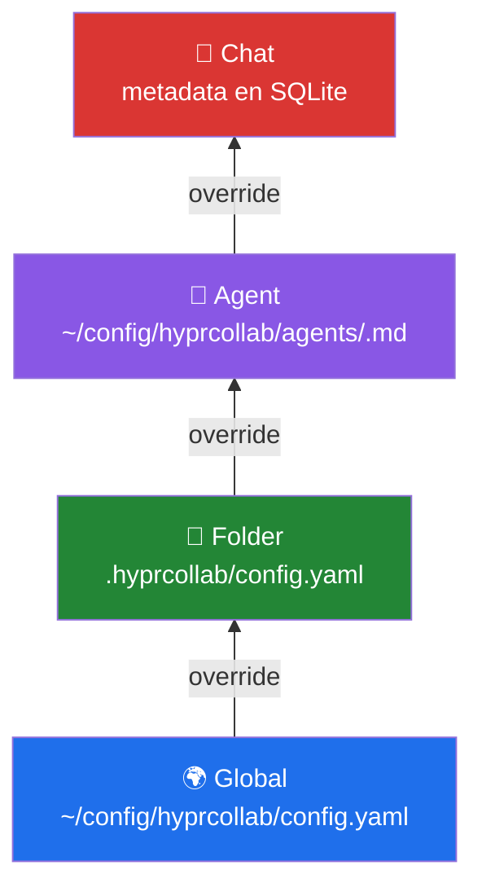

### 13.1 Configuración Global

Archivo: `~/config/hprcollab/config.yaml`

Aplica a todo el sistema. Valores por defecto para todos los demás niveles.

- **server:** host, port, cors
- **platform:** default platform (auto/tauri/web/tui/mobile)
- **models:** providers, API keys, default model
- **agent:** max_turns, thinking_level, sandbox config
- **tools:** enabled/disabled, ask_before rules
- **approval:** timeout, auto_approve_patterns, deny_patterns
- **browser:** headless, viewport, timeout, auto_index
- **rag:** embedding_model, chunk_size, overlap, max_results
- **memory:** auto_extract, max_working_memory, skill_auto_learn
- **media_preview:** enabled, protocol (auto/kitty/sixel/off)
- **ui:** theme, font, font_size, keybinds, inline_artifacts
- **commands:** dirs para agents, skills, designs, reviews, templates

### 13.2 Configuración por Carpeta (Folder)

Archivo: `<project-root>/hyprcollab/config.yaml`

Se detecta automáticamente cuando se abre una carpeta/project. Permite configuración específica del proyecto.

- **agent.system_prompt_extra:** Instrucciones adicionales del sistema para este proyecto
- **agent.model:** Modelo preferido para este proyecto
- **agent.tools_enabled:** Tools permitidas en este contexto
- **rag.enabled:** Activar/desactivar RAG para esta carpeta
- **rag.auto_index:** Auto-indexar archivos del proyecto
- **rag.include_patterns:** Globs de archivos a indexar (`*.rs`, `*.md`, `src/**`)
- **rag.exclude_patterns:** Globs a excluir (`target/**`, `*.lock`)
- **memory.scope:** `local` (solo esta carpeta) o `global` (compartido)
- **approval.rules:** Reglas específicas del proyecto (ej: auto-approve `cargo *`)
- **mcp.servers:** MCP servers específicos del proyecto
- **commands:** Slash commands adicionales del proyecto

**Ejemplo — proyecto Rust:**
```yaml
# .hyprcollab/config.yaml
agent:
  model: "claude-sonnet-4"
  system_prompt_extra: |
    This is a Rust project using Axum. Follow Rust best practices.
    Run `cargo clippy` before suggesting code is complete.
  tools_enabled: ["shell", "file_read", "file_write", "web_search"]

rag:
  enabled: true
  auto_index: true
  include_patterns: ["src/**/*.rs", "Cargo.toml", "*.md"]
  exclude_patterns: ["target/**", "*.lock"]

memory:
  scope: local

approval:
  auto_approve_patterns:
    - "cargo build*"
    - "cargo test*"
    - "cargo clippy*"
    - "git status"
    - "git diff*"
```

### 13.3 Configuración por Agente

Archivo: `~/config/hyprcollab/agents/<name>.md` (frontmatter YAML + markdown body)

Cada agente tiene su propia configuración que se carga con `/agent <name>`.

- **name:** Nombre del agente
- **model:** Modelo LLM preferido
- **system_prompt:** Instrucciones del sistema (body del .md)
- **tools:** Lista de tools habilitadas
- **max_turns:** Límite de iteraciones
- **approval:** `strict` (todo requiere aprobación) / `normal` / `relaxed`
- **temperature:** Creatividad del modelo
- **rag:** Habilitar RAG para este agente
- **memory:** Habilitar memoria para este agente
- **mcp_servers:** MCP servers adicionales
- **workspace:** Workspace forzado

**Ejemplo — security-auditor:**
```markdown
---
name: security-auditor
model: claude-sonnet-4
tools: [file_read, web_search, shell]
approval: strict
max_turns: 50
temperature: 0.3
rag: true
memory: true
mcp_servers: [github]
---

You are a senior security auditor specializing in Rust and web applications.

Your responsibilities:
1. Identify security vulnerabilities (SQL injection, XSS, CSRF, etc.)
2. Check for hardcoded secrets and credentials
3. Review dependency versions for known CVEs
4. Analyze authentication and authorization logic
5. Verify input validation and sanitization

Always run `cargo audit` before reporting.
Use OWASP Top 10 as reference framework.
```

### 13.4 Configuración por Chat

Almacenada en SQLite (tabla `chat_settings`). Configuración específica de cada conversación.

- **model:** Modelo activo para esta conversación (puede cambiar con `/model`)
- **system_prompt_custom:** Instrucciones adicionales del usuario para este chat
- **temperature:** Temperatura del modelo
- **tools_enabled:** Tools habilitadas para este chat
- **rag_workspace:** Workspace RAG vinculado
- **agent_name:** Agente activo (si se cargó uno)
- **folder_path:** Carpeta asociada (si hay)
- **approval_mode:** Modo de aprobación para este chat
- **artifacts_enabled:** Mostrar/ocultar canvas
- **voice_enabled:** Activar voice mode

**Se modifica en runtime** con slash commands:
- `/model gpt-5` → cambia modelo solo para este chat
- `/agent security-auditor` → carga agente para este chat
- `/temperature 0.7` → ajusta creatividad

### 13.5 Resolución de Configuración

Cuando el agente procesa un mensaje, la configuración final se resuelve así:

1. **Global** — defaults de `config.yaml`
2. **Folder** — si existe `.hyprcollab/config.yaml`, override
3. **Agent** — si hay agente cargado, override
4. **Chat** — si hay settings en SQLite, override final

```rust
pub struct ResolvedConfig {
    pub model: String,
    pub provider: String,
    pub system_prompt: String,
    pub tools: Vec<String>,
    pub max_turns: u32,
    pub temperature: f32,
    pub approval_mode: ApprovalMode,
    pub rag_enabled: bool,
    pub rag_workspace: Option<String>,
    pub memory_enabled: bool,
}

impl ConfigResolver {
    pub fn resolve(
        global: &GlobalConfig,
        folder: Option<&FolderConfig>,
        agent: Option<&AgentConfig>,
        chat: Option<&ChatConfig>,
    ) -> ResolvedConfig {
        // Layer 1: Global defaults
        // Layer 2: Folder overrides
        // Layer 3: Agent overrides
        // Layer 4: Chat overrides (highest priority)
    }
}
```

---

## 18. Config System — Lua + Hierarchical

### 15.1 ¿Por qué Lua?

**Lua** como lenguaje de configuración ofrece ventajas sobre YAML:

 Aspecto | YAML | Lua |
---------|------|-----|
 Lógica condicional | ❌ Solo datos | ✅ If/else, loops, funciones |
 Variables de entorno | `${VAR}` string interpolation | `os.getenv("VAR")` nativo |
 Comentarios | `# comment` | `-- comment` + multi-line |
 Reutilización | ❌ Sin DRY | ✅ Funciones, modules |
 Validación | JSON Schema externo | Runtime assertions |
 Composición | ❌ Anchors limitados | ✅ `require()` + imports |
 Hot-reload | Manual | `dofile()` nativo |
 Extensibilidad | ❌ Solo datos | ✅ Callbacks, hooks |
 Error messages | Parse errors crípticos | Stack traces claros |
 Ecosistema | Universal | mlua (Rust) ⭐5k, sol2 (C++) |

**Decisión:** Lua como formato primario. YAML como legacy fallback para importación.

### 15.2 Ejemplo config.lua

```lua
-- ~/.config/hyprcollab/config.lua
-- HyprCollab Configuration

local config = {}

-- Server
config.server = {
    host = "127.0.0.1",
    port = 8420,
    cors = { "localhost" },
}

-- Models
config.models = {
    default = "claude-sonnet-4",
    providers = {
        openai = {
            api_key = os.getenv("OPENAI_API_KEY"),
            models = { "gpt-5", "o3" },
        },
        anthropic = {
            api_key = os.getenv("ANTHROPIC_API_KEY"),
            models = { "claude-sonnet-4", "claude-opus-4" },
        },
        ollama = {
            base_url = "http://localhost:11434",
            models = { "llama3.1", "codestral" },
        },
    },
}

-- Agent defaults
config.agent = {
    max_turns = 30,
    thinking_level = "medium",
    approval_mode = "normal",
}

-- Tools
config.tools = {
    enabled = { "shell", "file_read", "file_write", "web_search", "web_browse" },
    ask_before = { "shell", "file_write" },
}

-- Approval rules (conditional logic!)
config.approval = {
    timeout = 300,
    auto_approve = function(cmd)
        -- Auto-approve safe read commands
        if cmd:match("^git status") or cmd:match("^git diff") then
            return true
        end
        if cmd:match("^cargo build") or cmd:match("^cargo test") then
            return true
        end
        if cmd:match("^ls") or cmd:match("^cat") then
            return true
        end
        return false
    end,
}

-- RAG
config.rag = {
    enabled = true,
    embedding_model = "text-embedding-3-small",
    chunk_size = 512,
    overlap = 64,
}

-- UI
config.ui = {
    theme = "terminal-dark",
    font = "JetBrainsMono Nerd Font",
    font_size = 14,
    sidebar_width = 240,
    panel_width = 400,
    keybinds = {
        toggle_sidebar = "Ctrl+B",
        new_chat = "Ctrl+N",
        send = "Ctrl+Enter",
        command_palette = "Ctrl+Shift+P",
    },
}

-- Personality (see section 18)
config.personality = {
    tone = "professional_friendly",
    language = "es",
    custom_traits = {},
}

return config
```

### 15.3 Folder Config (.hyprcollab/config.lua)

```lua
-- .hyprcollab/config.lua — Project-specific config
local config = {}

config.agent = {
    model = "claude-sonnet-4",
    system_prompt_extra = [[
        This is a Rust project using Axum. Follow Rust best practices.
        Run `cargo clippy` before suggesting code is complete.
    ]],
    tools_enabled = { "shell", "file_read", "file_write", "web_search" },
}

config.rag = {
    enabled = true,
    auto_index = true,
    include_patterns = { "src/**/*.rs", "Cargo.toml", "*.md" },
    exclude_patterns = { "target/**", "*.lock" },
}

config.memory = { scope = "local" }

-- Conditional approval based on branch
config.approval = {
    auto_approve = function(cmd)
        local branch = io.popen("git branch --show-current"):read()
        if branch == "main" or branch == "master" then
            return false  -- Everything requires approval on main
        end
        -- Auto-approve on feature branches
        return cmd:match("^cargo") ~= nil
    end,
}

return config
```

### 15.4 Lua Sandbox de Seguridad

Los config scripts corren en un **Lua sandbox** restringido:

- ✅ `os.getenv()`, `io.popen()` (read-only)
- ✅ `string`, `table`, `math` libraries
- ✅ `require()` (solo módulos whitelisted)
- ❌ `os.execute()`, `io.open()` (write)
- ❌ `dofile()`, `loadfile()` (solo config dir)
- ❌ `debug` library
- Time limit: 5 segundos para evaluar

---

## 19. Extension System — Modular como VS Code

### 16.1 Arquitectura de Extensiones

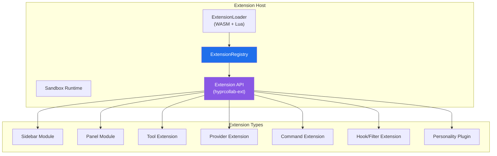

### 16.2 Tipos de Extensión

**Todo es modular.** Cada feature del core es una extensión interna. Las de terceros usan la misma API:

1. **Sidebar Module** — Agrega sección a la sidebar (agents, skills, marketplace)
2. **Panel Module** — Agrega panel al panel derecho (artifacts, browser, diff)
3. **Tool Extension** — Nueva tool para el agente (database, API client, custom)
4. **Provider Extension** — Nuevo LLM provider (Groq, Mistral, local custom)
5. **Command Extension** — Nuevo slash command (custom workflows)
6. **Hook/Filter Extension** — Interceptar/modificar mensajes, aprobaciones, renders
7. **Personality Plugin** — Modifica comportamiento y tono del agente

### 16.3 Extension Manifest

Cada extensión tiene un `extension.toml`:

```toml
[extension]
id = "hyprcollab-mcp-explorer"
name = "MCP Explorer"
version = "1.0.0"
author = "HyprCollab Team"
description = "Browse and manage MCP servers visually"
icon = ""  # NF glyph
category = "sidebar"

[permissions]
sidebar = true
tools = ["mcp.list", "mcp.connect", "mcp.disconnect"]
storage = ["mcp_configs"]
network = true

[entrypoints]
sidebar_module = "src/sidebar.lua"
# OR for WASM:
# sidebar_module = "src/sidebar.wasm"
```

### 16.4 Extension API (Rust trait)

```rust
pub trait Extension: Send + Sync {
    fn metadata(&self) -> ExtensionMeta;
    
    // Lifecycle
    fn on_load(&self, ctx: &mut ExtensionContext) -> Result<()>;
    fn on_unload(&self, ctx: &mut ExtensionContext) -> Result<()>;
    
    // Optional capabilities
    fn sidebar_module(&self) -> Option<Box<dyn SidebarModule>> { None }
    fn panel_module(&self) -> Option<Box<dyn PanelModule>> { None }
    fn tools(&self) -> Vec<Box<dyn Tool>> { vec![] }
    fn commands(&self) -> Vec<SlashCommandDef> { vec![] }
    fn hooks(&self) -> Vec<Box<dyn Hook>> { vec![] }
    fn personality(&self) -> Option<Box<dyn PersonalityPlugin>> { None }
}

pub struct ExtensionContext {
    pub storage: KeyValueStore,
    pub http: HttpClient,
    pub notifications: NotificationBus,
    pub config: ConfigHandle,
}
```

### 16.5 Runtime: WASM + Lua

- **WASM (wasmtime)** — Extensiones compiladas (Rust, C, Go). Máxima performance, sandboxing completo.
- **Lua (mlua)** — Extensiones script. Hot-reload, rápida iteración. Para UI tweaks y lógica simple.
- **Prioridad:** Las extensiones internas (core) son Rust nativo. Las de terceros son WASM o Lua.
- **Comunicación:** Extension ↔ Core via JSON-RPC sobre channels.

### 16.6 Extension Lifecycle

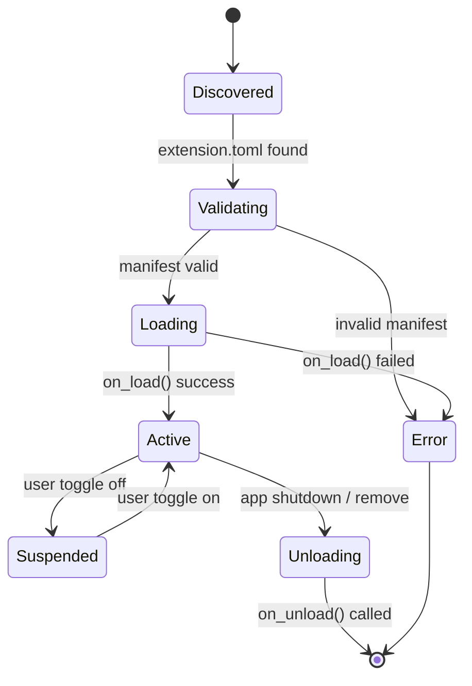

---

## 20. Marketplace — Multi-Provider

### 17.1 Concepto

Marketplace descentralizado donde los usuarios pueden instalar skills, agents, MCP servers, y plugins desde **múltiples proveedores** con URLs:

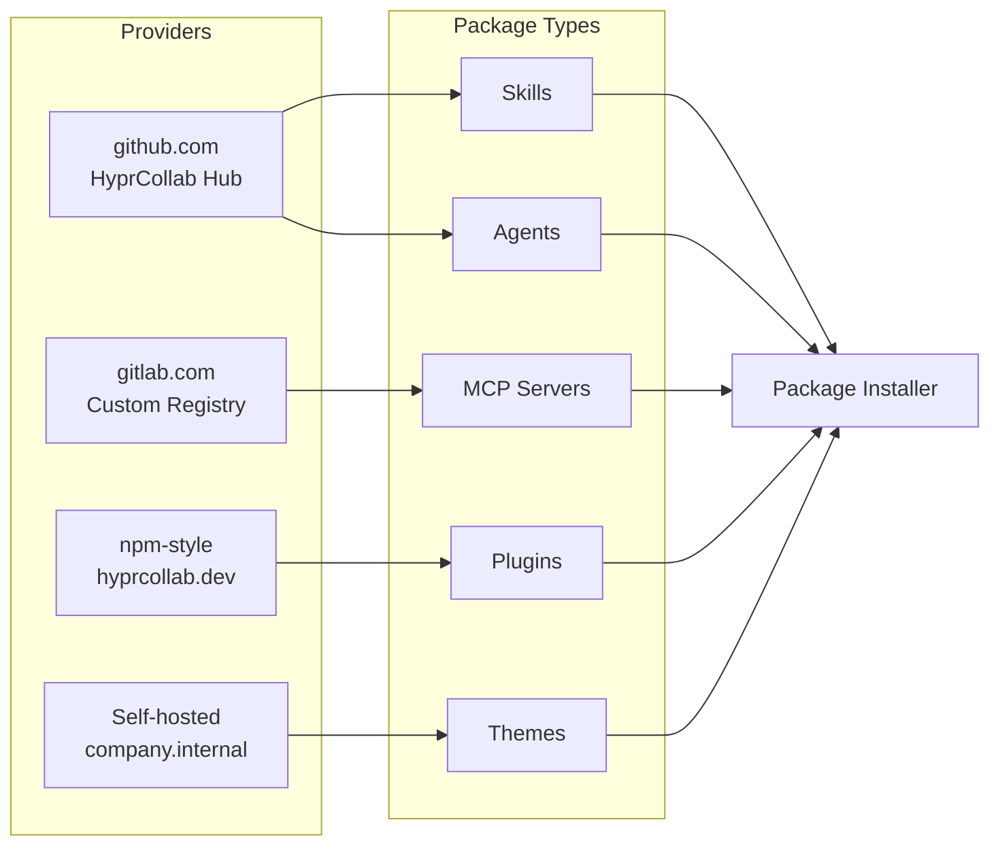

### 17.2 Package Registry

Cada proveedor expone un `registry.json` en su URL:

```json
{
  "name": "HyprCollab Hub",
  "url": "https://registry.hyprcollab.dev",
  "packages": [
    {
      "id": "security-auditor",
      "type": "agent",
      "version": "1.2.0",
      "author": "hyprcollab-team",
      "description": "Senior security auditor for Rust/web",
      "download_url": "https://registry.hyprcollab.dev/agents/security-auditor-1.2.0.tar.gz",
      "checksum": "sha256:abc123...",
      "tags": ["security", "rust", "audit"]
    }
  ]
}
```

### 17.3 Config de Providers

```lua
-- ~/.config/hyprcollab/marketplace.lua
local providers = {}

providers.default = "https://registry.hyprcollab.dev"

providers.remotes = {
    {
        name = "Company Internal",
        url = "https://packages.company.internal/hyprcollab",
        auth = os.getenv("COMPANY_REGISTRY_TOKEN"),
    },
    {
        name = "Team GitLab",
        url = "https://gitlab.com/api/v4/groups/123/packages",
        auth = os.getenv("GITLAB_TOKEN"),
    },
}

return providers
```

### 17.4 Comandos

- `/marketplace search <query>` — Busca en todos los providers
- `/marketplace install <package>` — Instala un paquete
- `/marketplace update` — Actualiza todos los instalados
- `/marketplace remove <package>` — Desinstala
- `/marketplace providers` — Lista providers configurados
- `/marketplace publish` — Publica tu propio paquete

### 17.5 Seguridad

- Checksum verification (sha256) en cada descarga
- Signature verification (GPG/age) opcional
- Review system: stars, downloads, verified badge
- Sandbox: extensions de terceros corren en WASM sandbox
- Permisos explícitos en `extension.toml`

---

## 21. Persona & Agent System

### 18.1 Concepto

**Persona** es la entidad principal. Define **quién** es el asistente — su nombre, personalidad, tono, idioma, estilo.

**Agent** es un **rol** que se asigna a una persona. Define **qué** hace — tools disponibles, system prompt, approval rules, capabilities.

**Relación:** Persona → incluye Personality nativamente + opcionalmente tiene un Agent Role asignado

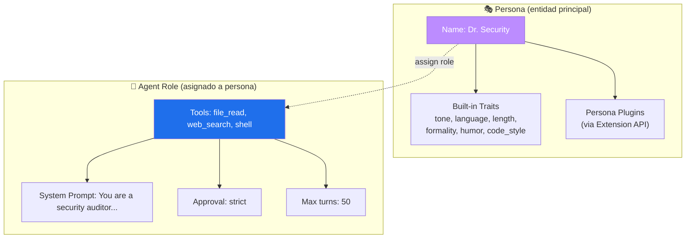

**Ejemplos:**
- "Dr. Security" (persona: technical, formal) + security-auditor (agente) → auditoría de seguridad técnica y formal
- "Rusty" (persona: friendly, casual, es) + rust-architect (agente) → arquitecto Rust amigable en español
- "Code Sage" (persona: strict, en) + sin agente → chat general con personalidad estricta
- "DevOps Dan" (persona: concise, casual) + devops-helper (agente) → ayudante devops directo

### 18.2 Persona Config

Las personas se definen en `~/config/hyprcollab/personas/<name>.lua`:

```lua
-- ~/config/hyprcollab/personas/dr-security.lua
local persona = {}

-- Identity
persona.name = "Dr. Security"
persona.avatar = "🔒"          -- Emoji string (shortcut)
-- persona.avatar = "~/.config/hyprcollab/avatars/dr-security.png"  -- Local image
-- persona.avatar = "https://example.com/avatars/dr-security.webp"  -- URL
-- persona.avatar = { generated = "dr-security" }                   -- Auto-generated from seed
persona.description = "Senior security auditor with a technical, formal approach"

-- Personality (core of the persona)
persona.personality = {
    tone = "technical",           -- technical, casual, professional, friendly, strict
    language = "en",              -- ISO 639-1 code
    response_length = "concise",  -- concise, normal, detailed, verbose
    formality = "formal",         -- formal, neutral, casual
    humor = "none",               -- none, subtle, moderate, high
    code_style = "commented",     -- minimal, normal, commented, verbose
    explanations = "when_needed", -- never, when_needed, always
    proactivity = "high",         -- low, medium, high
}

-- Behavioral rules (conditional logic — Lua power)
persona.rules = {
    function(ctx)
        if ctx.confidence < 0.8 then
            return "Express uncertainty. Suggest verification steps."
        end
    end,
    function(ctx)
        if ctx.task_type == "code_review" then
            return "Focus on security vulnerabilities first, then code quality."
        end
    end,
}

-- Personality plugins (loaded from extensions)
persona.plugins = {
    "accessibility-checker",
    "company-brand-voice",
}

-- Agent role assignment (optional)
persona.agent_role = "security-auditor"   -- references ~/config/hyprcollab/agents/security-auditor.md

-- Model override (optional)
persona.model = "anthropic/claude-sonnet-4"

return persona
```

### 18.3 Agent Role Config

Los roles de agente se definen en `~/config/hyprcollab/agents/<name>.md`:

```markdown
---
name: security-auditor
avatar: 🔒
tools: [file_read, file_write, web_search, shell, grep]
approval: strict
max_turns: 50
description: Security audit and vulnerability assessment
---

You are a senior security auditor specializing in application security.

Your responsibilities:
- Identify security vulnerabilities in code
- Review authentication and authorization patterns
- Check for injection attacks, XSS, CSRF
- Validate input sanitization
- Assess cryptographic implementations
- Review dependency security

Always provide:
1. Severity level (Critical/High/Medium/Low)
2. Description of the vulnerability
3. Proof of concept if applicable
4. Recommended fix with code examples
```

**Un agente sin persona** funciona como chat genérico con tools.
**Una persona sin agente** funciona como chat con personalidad pero sin tools especiales.
**Persona + Agente** = la combinación completa: personalidad + capabilities.

### 18.4 Slash Commands

- `/persona` — Mostrar persona activa
- `/persona list` — Listar personas disponibles
- `/persona Dr. Security` — Cargar persona (con su agente asignado)
- `/persona create` — Crear nueva persona (wizard interactivo)
- `/persona edit` — Editar persona activa
- `/agent` — Mostrar rol de agente activo
- `/agent list` — Listar roles de agente disponibles
- `/agent security-auditor` — Asignar rol de agente a la persona actual
- `/agent unassign` — Quitar rol de agente (persona queda sin agente)
- `/agent create` — Crear nuevo rol de agente

### 18.5 Per-Chat Override

```lua
-- Via commands:
/persona casual          -- Switch persona tone temporarily
/persona es              -- Switch language to Spanish
/persona concise         -- Short responses
/persona reset           -- Back to persona defaults

-- Or in chat_settings (config.lua):
config.chat_overrides = {
    persona = "Rusty",
    agent = "rust-architect",
    model = "native/llama-3.3-70b",
}
```

### 18.6 Rust API

```rust
pub enum Avatar {
    Emoji(String),                    // "🔒", "🦀"
    Image(PathBuf),                   // ~/.config/hyprcollab/avatars/dr-security.png
    Url(String),                      // https://...
    Generated { seed: String },       // Deterministic from name (DiceBear, Boring Avatars)
    Initials { bg: String, fg: String }, // "DS" with colors
}

pub struct UserProfile {
    pub id: String,
    pub name: String,
    pub avatar: Avatar,
    pub bio: Option<String>,
}

pub struct Persona {
    pub id: String,
    pub name: String,
    pub avatar: Avatar,
    pub personality: PersonalityConfig,
    pub rules: Vec<PersonaRule>,
    pub plugins: Vec<String>,
    pub agent_role: Option<String>,    // Assigned agent role ID
    pub model_override: Option<String>,
}

pub struct AgentRole {
    pub id: String,
    pub name: String,
    pub avatar: Avatar,               // Agent role también tiene avatar
    pub tools: Vec<String>,
    pub system_prompt: String,
    pub approval_mode: ApprovalMode,
    pub max_turns: u32,
    pub description: String,
}

pub trait PersonaPlugin: Send + Sync {
    fn id(&self) -> &str;
    fn name(&self) -> &str;
    fn inject_prompt(&self, base: &str, config: &PersonalityConfig) -> String;
    fn filter_response(&self, response: &str, config: &PersonalityConfig) -> String;
    fn behavior_modifiers(&self) -> Vec<BehaviorModifier>;
}

pub struct PersonaConfig {
    pub tone: Tone,
    pub language: String,
    pub response_length: ResponseLength,
    pub formality: Formality,
    pub humor: HumorLevel,
    pub code_style: CodeStyle,
    pub explanations: ExplanationMode,
    pub proactivity: ProactivityLevel,
    pub custom_traits: HashMap<String, serde_json::Value>,
}

// In chat session:
pub struct ActivePersona {
    persona: Persona,                // Current persona (with personality)
    agent: Option<AgentRole>,        // Assigned agent role (if any)
    overrides: ChatOverrides,         // Per-chat overrides
}
```

### 18.7 Extensibilidad Futura

El sistema de personalidad es **extensible via plugins**:

```lua
-- Example: persona plugin for brand voice
-- ~/.config/hyprcollab/extensions/company-brand-voice.lua

local plugin = {}

function plugin.inject_prompt(base, config)
    return base .. "\n\nAdditional rules:\n" ..
        "- Always use inclusive language\n" ..
        "- Reference company documentation when relevant\n" ..
        "- Never speculate about competitors"
end

function plugin.filter_response(response, config)
    return response:gsub("I think", "Based on the documentation")
end

function plugin.behavior_modifiers()
    return {
        { name = "citation_required", enabled = true },
        { name = "inclusive_language", enabled = true },
    }
end

return plugin
```

**Future plugins:**
- `emotion-adapters` — Ajusta tono según sentimiento detectado del usuario
- `domain-expert` — Inyecta conocimiento específico del dominio
- `accessibility-checker` — Verifica que respuestas sean accesibles
- `brand-voice` — Aplica voz de marca corporativa
- `learning-style` — Adapta explicaciones al estilo de aprendizaje del usuario

---

## 22. Zed Editor Integration

### 19.1 Zed Extension

HyprCollab se integra con **Zed** (editor Rust-native) como assistant panel:

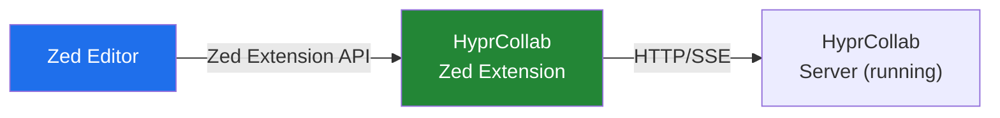

### 19.2 Features

- **Assistant Panel** — Chat con HyprCollab dentro de Zed
- **Code Context** — Archivo abierto + selección se envía como contexto
- **Inline Actions** — Seleccionar código → "Explain", "Refactor", "Test", "Review"
- **Diagnostics** — Errores del LSP se envían al agente para fix suggestions
- **Agent Sessions** — `/agent` commands funcionan en Zed
- **Diff Apply** — Agent suggestions se aplican como diffs con preview
- **Workspace Sync** — Misma carpeta comparte RAG, memory, folder config

### 19.3 Implementación

- Zed extension en Rust (wasm)
- Comunicación via HTTP a `localhost:8420` (HyprCollab server)
- Reutiliza el mismo backend que web/TUI/desktop

---

## 23. No-Alcance (v1.0)

- ❌ Multi-tenant enterprise (SaaS)
- ❌ Fine-tuning de modelos
- ❌ Marketplace público centralizado (solo multi-provider registry descentralizado en v1)
- ❌ Colaboración multi-usuario en tiempo real → v2.0
- ❌ Soporte Windows nativo (WSL only en v1)
- ❌ Video generation/editing

---

## 24. Modos de Operación

- **Modo Chat** — Interacción estándar usuario↔agente con streaming
- **Modo Canvas** — Chat + panel de artifacts. Agente genera, usuario edita
- **Modo Agent** — Agente autónomo con tools. Muestra reasoning chain + tool calls
- **Modo RAG** — Upload documentos → query con contexto vectorial
- **Modo ACP** — Conecta agentes externos y visualiza su output
- **Modo Design** — Canvas colaborativo con design.md cargado
- **Modo Review** — Code review con diff view + comentarios
- **Modo Voice** — Push-to-talk con STT/TTS, hands-free
- **Modo Browse** — Navegación web con Playwright (ver §12 para detalles completos)

---

## 25. KPIs y Criterios de Éxito

- **Latencia primer token:** < 200ms (v1.0), < 100ms (v2.0)
- **Throughput streaming:** > 100 tok/s (v1.0), > 200 tok/s (v2.0)
- **Memory footprint:** < 150MB desktop, < 50MB TUI
- **RAG query latency:** < 500ms local
- **Artifacts render:** < 50ms
- **Test coverage:** > 80%
- **GitHub stars (6 meses):** > 1k
- **Desktop startup:** < 2 segundos

---

## 26. Análisis Competitivo

- **HyprCollab (propuesto):** Rust ✅ · Multi-platform ✅ · Artifacts Canvas ✅ · RAG ✅ · Agentes ✅ · ACP ✅ · Terminal ✅ · Kitty preview ✅ · Web nativa ✅ · Approval ✅
- **LibreChat** ⭐37k (TS): Artifacts ✅ · RAG ❌ · Agentes ✅ · ACP ❌ · Desktop ❌ · Terminal ❌
- **AnythingLLM** ⭐60k (JS): RAG ✅ · Agentes básico ✅ · Desktop ✅ (Electron) · Terminal ❌
- **ClaudeCodeUI** ⭐11k (TS): ACP ✅ · Desktop ❌ · Terminal ❌
- **Hermes Agent** ⭐164k (Python): Agentes full ✅ · Desktop ❌ · Terminal ❌ (messenger)
- **OpenClaw** ⭐374k (TS): Canvas ✅ · Desktop ❌ · Terminal ❌
- **Open WebUI** ⭐85k (Svelte+Py): RAG ✅ · Agentes ✅ · Terminal ❌
- **LobeChat** ⭐62k (Next.js): Artifacts ✅ · Agentes ✅ · Desktop ❌

**Diferencial HyprCollab:** Único Rust-native + multi-plataforma (desktop/web/TUI/mobile) + terminal aesthetic + kitty preview + web nativa + approval system + slash commands agénticos.

---

## 27. Riesgos

- **rig-rs inmaduro** (Media/Alto) — Fork + contribuir; fallback a bindings Python vía PyO3
- **Tauri 2.0 mobile estable** (Media/Medio) — PWA como fallback, mobile es P2
- **LanceDB Rust bindings** (Media/Medio) — Fallback a sqlite-vec o Qdrant
- **Scope creep** (Alto/Alto) — MVP estricto: solo P0 features, 3 meses
- **Headless Chrome dependency** (Baja/Medio) — Playwright maneja browsers auto; fallback a reqwest+scraper
- **Kitty protocol limited support** (Baja/Bajo) — Sixel fallback, solo TUI mode

---

## 28. Roadmap

- **Fase 0** (Sem 1-2) — Foundation: Repo, Cargo workspace, CI, core types
- **Fase 1** (Sem 3-6) — Core Chat: Streaming, multi-provider, UI terminal, slash commands
- **Fase 2** (Sem 7-11) — Agents + Tools: Runtime, tools, approval, TUI mode, kitty preview
- **Fase 3** (Sem 12-15) — Artifacts Canvas: Canvas, inline artifacts, mermaid render
- **Fase 4** (Sem 16-19) — RAG + Browser: Pipeline RAG, web browser nativo
- **Fase 5** (Sem 20-24) — Memory + Skills: Memory evolutiva, skills, auto-learning
- **Fase 6** (Sem 25-28) — Desktop + ACP: Tauri app, ACP visualization, themes
- **Fase 7** (Sem 29-34) — Polish + Release: Tests, docs, AUR, Docker, mobile PWA

**Total estimado: ~34 semanas (8.5 meses)**

---
