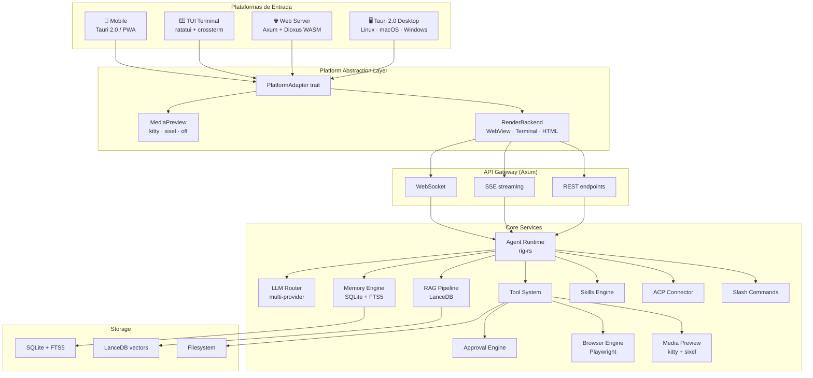
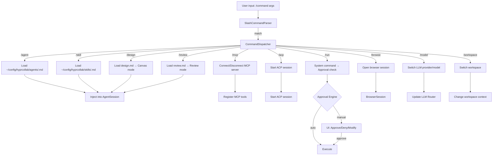
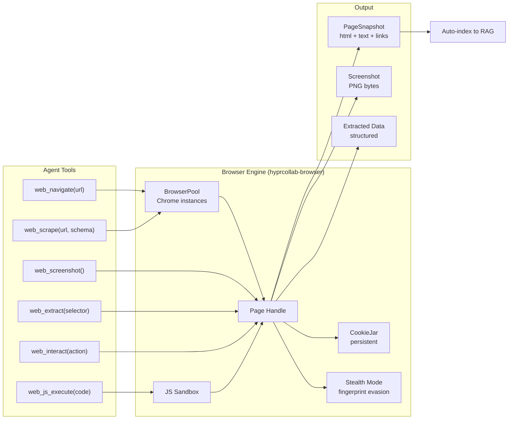
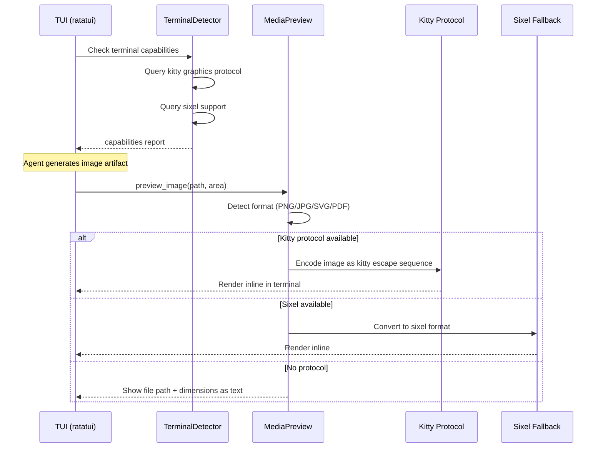
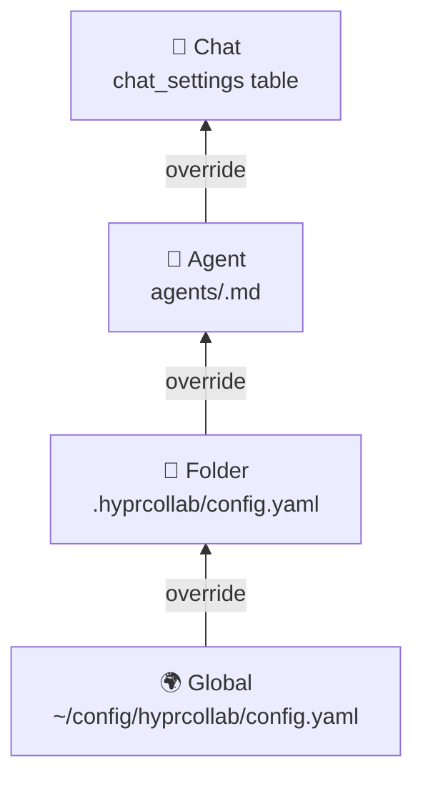

# HyprCollab — Technical Requirements Document

> **OpenSpec SSD v2.0** · Agentic AI Chat Platform · Rust 2024 Edition · Multi-Platform

---

## 1. Diagramas de Arquitectura

### 1.1 Arquitectura Multi-Plataforma



### 1.2 Flujo de Slash Commands



### 1.3 Browser Engine Architecture



### 1.4 Kitty Image Protocol Flow



---

## 2. Componentes

### 2.1 LLM Router

Gateway multi-provider. Unifica OpenAI, Anthropic, Ollama, OpenRouter bajo un solo trait.

```rust
#[async_trait]
pub trait LlmProvider: Send + Sync {
    async fn chat_completion(&self, req: ChatRequest) -> Result<ChatResponse>;
    async fn chat_stream(&self, req: ChatRequest) -> Result<Pin<Box<dyn Stream<Item = Result<TokenChunk>> + Send>>>;
    async fn embeddings(&self, text: &str) -> Result<Vec<f32>>;
    fn models(&self) -> Vec<ModelInfo>;
    fn name(&self) -> &str;
    fn supports_streaming(&self) -> bool;
    fn supports_tools(&self) -> bool;
}

pub struct LlmRouter {
    providers: HashMap<String, Box<dyn LlmProvider>>,
    default: String,
    fallback: Vec<String>,
}
```

Providers como crates separados:
- `hyprcollab-provider-native` — GGUF directo (llama.cpp bindgen + candle pure Rust + mistral.rs)
- `hyprcollab-provider-openai` — OpenAI + cualquier OpenAI-compatible URL
- `hyprcollab-provider-anthropic` — Claude directo
- `hyprcollab-provider-ollama` — Ollama (auto-discover models, auto-start)
- `hyprcollab-provider-openrouter` — Aggregator

**Native GGUF:**
- `llama.cpp` via bindgen — CUDA/Metal/Vulkan GPU, todos los quant levels
- `candle` — Pure Rust inference, sin C dependencies
- `mistral.rs` — ISQ quant, Flash Attention, CUDA/Metal
- Auto-download desde HuggingFace via `hf-hub`
- Model storage: `~/.local/share/hyprcollab/models/*.gguf`
- Hot-swap: load/unload sin reiniciar
- GPU layer management: config por modelo
- Multi-model: varios modelos en memoria simultáneamente

### 2.2 Agent Runtime (rig-rs)

```rust
pub struct AgentSession {
    agent: Agent<LlmProvider>,
    tools: ToolRegistry,
    memory: SessionMemory,
    skills: SkillMatcher,
    slash_commands: CommandDispatcher,
    max_turns: u32,
    workspace: WorkspaceId,
    approval_engine: ApprovalEngine,
    current_cwd: PathBuf,
    env_vars: HashMap<String, String>,
}
```

**Memoria evolutiva (inspirado en Hermes):**
- `ShortTermMemory` — Context window de la conversación actual
- `WorkingMemory` — Hechos extraídos entre sesiones
- `SkillMemory` — Skills aprendidas de patrones de uso
- `PreferenceMemory` — Preferencias inferidas del usuario

### 2.3 Platform Adapter

Trait que abstrae la plataforma de ejecución:

```rust
pub trait PlatformAdapter: Send + Sync {
    fn platform_name(&self) -> &str;
    fn supports_media_preview(&self) -> bool;
    fn supports_browser(&self) -> bool;
    fn supports_notifications(&self) -> bool;
    fn open_external(&self, url: &str) -> Result<()>;
    fn show_approval_dialog(&self, request: &ApprovalRequest) -> ApprovalFuture;
}

// Implementaciones:
pub struct TauriAdapter;      // Desktop (Tauri 2.0)
pub struct WebAdapter;         // Web browser (WASM)
pub struct TuiAdapter;         // Terminal (ratatui)
pub struct MobileAdapter;      // iOS/Android (Tauri mobile)
```

### 2.4 RAG Engine

```
Upload → Parse → Chunk → Embed → Store (LanceDB)
Query  → Embed → Vector Search → Rerank → Inject Context
```

**Parsers soportados:**
- PDF (pdf-rs)
- Markdown (pulldown-cmark)
- Code files (tree-sitter para AST-aware chunking)
- Plain text / CSV / JSON
- HTML (html5ever)
- Web pages (via Browser Engine)

### 2.5 Artifacts Canvas

**Tipos soportados:**
- **Code:** Syntax highlight via tree-sitter + CSS classes
- **Markdown:** Rich render via pulldown-cmark → HTML
- **SVG:** Inline render via resvg
- **React/JSX:** Sandboxed preview en iframe
- **Mermaid:** Diagram render via mermaid.js WASM
- **LaTeX:** Math render via katex WASM
- **CSV/Table:** Sortable table component
- **HTML:** Sandboxed iframe preview
- **Images:** Direct render (PNG, JPG, WebP)
- **PDF:** Embedded viewer

```rust
pub enum Artifact {
    Code { lang: String, content: String },
    Markdown(String),
    Svg(String),
    React { code: String, dependencies: HashMap<String, String> },
    Mermaid(String),
    Html(String),
    Image { path: PathBuf, data: Vec<u8> },
    Pdf { path: PathBuf },
    Table { headers: Vec<String>, rows: Vec<Vec<String>> },
}
```

### 2.6 ACP Connector

```rust
#[async_trait]
pub trait AcpConnector: Send + Sync {
    fn name(&self) -> &str;
    async fn start_session(&self, config: AcpConfig) -> Result<AcpSession>;
    async fn send_prompt(&self, session: &AcpSession, prompt: &str) -> Result<()>;
    fn stream_output(&self, session: &AcpSession) -> Pin<Box<dyn Stream<Item = AcpEvent> + Send>>;
}

pub enum AcpEvent {
    Token(String),
    ToolCall { name: String, input: Value, output: Value },
    FileChange { path: String, diff: String },
    Thinking(String),
    Error(String),
    Done,
}
```

**Connectores:** claude-code, codex, agy

### 2.7 Slash Commands Engine

Sistema extensible de comandos con parser y dispatcher:

```rust
#[async_trait]
pub trait SlashCommand: Send + Sync {
    fn name(&self) -> &str;
    fn aliases(&self) -> Vec<&str>;
    fn description(&self) -> &str;
    fn completions(&self, partial: &str) -> Vec<String>;
    async fn execute(&self, args: &str, ctx: &CommandContext) -> Result<CommandResult>;
}

pub struct CommandDispatcher {
    commands: HashMap<String, Box<dyn SlashCommand>>,
    agents_dir: PathBuf,    // ~/config/hyprcollab/agents/
    skills_dir: PathBuf,    // ~/config/hyprcollab/skills/
    designs_dir: PathBuf,   // ~/config/hyprcollab/designs/
    reviews_dir: PathBuf,   // ~/config/hyprcollab/reviews/
}

pub struct CommandContext {
    pub session: Arc<Mutex<AgentSession>>,
    pub workspace: WorkspaceId,
    pub platform: Arc<dyn PlatformAdapter>,
    pub renderer: Arc<dyn RenderBackend>,
}
```

**Archivo .md de agente (ejemplo):**
```markdown
---
name: security-auditor
model: claude-sonnet-4
tools: [file_read, web_search, shell]
approval: strict
max_turns: 50
system_prompt: |
  You are a senior security auditor...
---

# Security Auditor Agent

This agent specializes in code security review...
```

### 2.8 Browser Engine

```rust
/// Playwright-backed browser driver (struct implementing the BrowserEngine trait).
/// Manages a pool of Chrome instances, persistent cookies, and stealth configuration.
pub struct PlaywrightDriver {
    pool: BrowserPool,
    cookie_jar: CookieJar,
    config: BrowserConfig,
}

pub struct PageSnapshot {
    pub url: String,
    pub title: String,
    pub html: String,
    pub text: String,
    pub links: Vec<LinkInfo>,
    pub screenshot: Option<Vec<u8>>,
}

pub struct BrowserConfig {
    pub headless: bool,
    pub viewport: (u32, u32),
    pub user_agent: Option<String>,
    pub timeout: Duration,
    pub auto_index: bool,         // Auto-index to RAG
    pub stealth_mode: StealthConfig,
}

/// Stealth mode configuration for anti-detection browsing.
pub struct StealthConfig {
    pub enabled: bool,
    pub mask_webdriver: bool,     // Remove navigator.webdriver flag
    pub randomize_viewport: bool, // Randomize viewport size within tolerance
    pub humanize_delays: bool,    // Add random delays between interactions
    pub mask_fingerprint: bool,   // Canvas/WebGL fingerprint randomization
    pub proxy: Option<ProxyConfig>,
}

pub struct ProxyConfig {
    pub host: String,
    pub port: u16,
    pub username: Option<String>,
    pub password: Option<String>,
}

impl PlaywrightDriver {
    pub async fn navigate(&self, url: &str) -> Result<PageSnapshot>;
    pub async fn screenshot(&self) -> Result<Vec<u8>>;
    pub async fn extract(&self, selector: &str) -> Result<Vec<String>>;
    pub async fn interact(&self, action: Interaction) -> Result<()>;
    pub async fn execute_js(&self, code: &str) -> Result<Value>;
    /// Scrape a URL using a CSS/XPath selector schema and return structured data.
    /// Supports extraction of text, attributes, tables, and nested structures.
    pub async fn web_scrape(&self, url: &str, schema: &ScrapeSchema) -> Result<ScrapedData>;
}
```

### 2.9 Media Preview (TUI Kitty Protocol)

```rust
pub struct MediaPreview {
    protocol: PreviewProtocol,
    terminal_size: (u16, u16),
}

pub enum PreviewProtocol {
    Kitty(KittyGraphics),
    Sixel(SixelEncoder),
    None,
}

impl MediaPreview {
    pub fn detect() -> Self;
    pub fn preview_image(&self, path: &Path, area: Rect) -> Result<()>;
    pub fn preview_code(&self, code: &str, lang: &str, area: Rect) -> Result<()>;
    pub fn preview_pdf_page(&self, path: &Path, page: usize, area: Rect) -> Result<()>;
    pub fn preview_svg(&self, svg: &str, area: Rect) -> Result<()>;
    pub fn preview_markdown(&self, md: &str, area: Rect) -> Result<()>;
    pub fn clear(&self, area: Rect) -> Result<()>;
}
```

### 2.10 Approval Engine

```rust
pub struct ApprovalEngine {
    rules: Vec<ApprovalRule>,
    log: Arc<ApprovalLog>,
    timeout: Duration,
}

pub struct ApprovalRule {
    pub tool_name: Option<String>,
    pub pattern: Option<Regex>,
    pub auto_approve: bool,
    pub workspace: Option<String>,
}

pub enum ApprovalVerdict {
    Approved,
    Denied { reason: String },
    Modified { new_command: String },
}

pub struct ApprovalRequest {
    pub id: Uuid,
    pub tool: String,
    pub action: String,
    pub args: Value,
    pub risk_level: RiskLevel,
    pub context: String,
    pub timestamp: DateTime<Utc>,
}

pub enum RiskLevel {
    Low,      // read-only operations
    Medium,   // network requests, web interactions
    High,     // file writes, shell commands
    Critical, // destructive commands (rm, format, etc.)
}
```

### 2.11 Shell Tool (Enhanced)

```rust
pub struct ShellTool {
    cwd: Arc<Mutex<PathBuf>>,
    env: Arc<Mutex<HashMap<String, String>>>,
    background_processes: Arc<Mutex<HashMap<Uuid, BackgroundProcess>>>,
    pty_alloc: Option<PtyAllocator>,
    approval: Arc<ApprovalEngine>,
}

pub struct BackgroundProcess {
    id: Uuid,
    command: String,
    pid: u32,
    started_at: DateTime<Utc>,
    status: ProcessStatus,
}

pub enum ProcessStatus {
    Running,
    Stopped,
    Exited(i32),
}
```

---

## 3. Schema SQL

```sql
-- Conversaciones (tree structure para branching)
CREATE TABLE conversations (
    id TEXT PRIMARY KEY,
    workspace_id TEXT NOT NULL,
    parent_id TEXT,
    branch_point_msg_id INTEGER,
    title TEXT,
    folder_path TEXT,
    created_at INTEGER NOT NULL,
    updated_at INTEGER NOT NULL,
    model TEXT,
    provider TEXT,
    tokens_used INTEGER DEFAULT 0,
    is_pinned BOOLEAN DEFAULT 0,
    FOREIGN KEY (workspace_id) REFERENCES workspaces(id),
    FOREIGN KEY (parent_id) REFERENCES conversations(id)
);

-- Mensajes
CREATE TABLE messages (
    id INTEGER PRIMARY KEY AUTOINCREMENT,
    conversation_id TEXT NOT NULL,
    role TEXT NOT NULL CHECK(role IN ('user','assistant','system','tool')),
    content TEXT NOT NULL,
    model TEXT,
    tokens INTEGER,
    tool_calls TEXT,
    artifact_id TEXT,
    is_bookmarked BOOLEAN DEFAULT 0,
    created_at INTEGER NOT NULL,
    FOREIGN KEY (conversation_id) REFERENCES conversations(id)
);

-- Configuración por chat
CREATE TABLE chat_settings (
    conversation_id TEXT PRIMARY KEY,
    model TEXT,
    provider TEXT,
    system_prompt_custom TEXT,
    temperature REAL,
    tools_enabled TEXT,        -- JSON array
    tools_disabled TEXT,       -- JSON array
    rag_workspace TEXT,
    agent_name TEXT,
    folder_path TEXT,
    approval_mode TEXT CHECK(approval_mode IN ('strict','normal','relaxed')) DEFAULT 'normal',
    artifacts_enabled BOOLEAN DEFAULT 1,
    voice_enabled BOOLEAN DEFAULT 0,
    extra TEXT,                -- JSON for extensibility
    updated_at INTEGER NOT NULL,
    FOREIGN KEY (conversation_id) REFERENCES conversations(id)
);

-- Configuración por carpeta (cache de .hyprcollab/config.yaml)
CREATE TABLE folder_configs (
    path TEXT PRIMARY KEY,     -- absolute path
    config TEXT NOT NULL,      -- YAML serialized
    detected_at INTEGER NOT NULL,
    last_modified INTEGER NOT NULL
);

-- Artefactos inline
CREATE TABLE artifacts (
    id TEXT PRIMARY KEY,
    conversation_id TEXT NOT NULL,
    message_id INTEGER NOT NULL,
    artifact_type TEXT NOT NULL CHECK(artifact_type IN (
        'code','markdown','svg','react','mermaid','html','image','pdf','table'
    )),
    content TEXT NOT NULL,
    metadata TEXT,
    version INTEGER DEFAULT 1,
    created_at INTEGER NOT NULL,
    updated_at INTEGER NOT NULL,
    FOREIGN KEY (conversation_id) REFERENCES conversations(id),
    FOREIGN KEY (message_id) REFERENCES messages(id)
);

-- Memoria de trabajo
CREATE TABLE working_memory (
    id INTEGER PRIMARY KEY AUTOINCREMENT,
    workspace_id TEXT NOT NULL,
    category TEXT NOT NULL CHECK(category IN ('preference','fact','pattern','correction')),
    key TEXT NOT NULL,
    value TEXT NOT NULL,
    confidence REAL DEFAULT 1.0,
    source_conversation_id TEXT,
    created_at INTEGER NOT NULL,
    updated_at INTEGER NOT NULL,
    UNIQUE(workspace_id, category, key)
);

-- Skills aprendidas
CREATE TABLE skills (
    id TEXT PRIMARY KEY,
    name TEXT NOT NULL UNIQUE,
    description TEXT,
    content TEXT NOT NULL,
    source TEXT CHECK(source IN ('user','agent','marketplace')),
    usage_count INTEGER DEFAULT 0,
    success_rate REAL DEFAULT 0.0,
    created_at INTEGER NOT NULL,
    updated_at INTEGER NOT NULL,
    workspace_id TEXT
);

-- Documentos RAG
CREATE TABLE documents (
    id TEXT PRIMARY KEY,
    workspace_id TEXT NOT NULL,
    filename TEXT NOT NULL,
    file_type TEXT NOT NULL,
    file_size INTEGER,
    chunk_count INTEGER,
    checksum TEXT,
    source_url TEXT,
    created_at INTEGER NOT NULL,
    FOREIGN KEY (workspace_id) REFERENCES workspaces(id)
);

-- Workspaces
CREATE TABLE workspaces (
    id TEXT PRIMARY KEY,
    name TEXT NOT NULL,
    description TEXT,
    settings TEXT,
    folder_path TEXT,
    created_at INTEGER NOT NULL,
    updated_at INTEGER NOT NULL
);

-- Aprobaciones
CREATE TABLE approval_log (
    id INTEGER PRIMARY KEY AUTOINCREMENT,
    request_id TEXT NOT NULL,
    tool TEXT NOT NULL,
    action TEXT NOT NULL,
    args TEXT,
    risk_level TEXT NOT NULL,
    verdict TEXT NOT NULL CHECK(verdict IN ('approved','denied','modified')),
    modified_command TEXT,
    user_response_time_ms INTEGER,
    created_at INTEGER NOT NULL
);

-- Reglas de aprobación
CREATE TABLE approval_rules (
    id INTEGER PRIMARY KEY AUTOINCREMENT,
    tool_name TEXT,
    pattern TEXT,
    auto_approve BOOLEAN DEFAULT 0,
    workspace TEXT,
    scope TEXT CHECK(scope IN ('global','folder','agent','chat')) DEFAULT 'global',
    priority INTEGER DEFAULT 0,
    created_at INTEGER NOT NULL
);

-- Uso de tokens
CREATE TABLE token_usage (
    id INTEGER PRIMARY KEY AUTOINCREMENT,
    conversation_id TEXT,
    workspace_id TEXT NOT NULL,
    provider TEXT NOT NULL,
    model TEXT NOT NULL,
    input_tokens INTEGER NOT NULL,
    output_tokens INTEGER NOT NULL,
    cost_usd REAL,
    created_at INTEGER NOT NULL,
    FOREIGN KEY (conversation_id) REFERENCES conversations(id),
    FOREIGN KEY (workspace_id) REFERENCES workspaces(id)
);

-- Templates de prompts
CREATE TABLE prompt_templates (
    id TEXT PRIMARY KEY,
    name TEXT NOT NULL,
    description TEXT,
    template TEXT NOT NULL,
    variables TEXT,
    category TEXT,
    created_at INTEGER NOT NULL,
    updated_at INTEGER NOT NULL
);

-- Sesiones ACP
CREATE TABLE acp_sessions (
    id TEXT PRIMARY KEY,
    connector TEXT NOT NULL,
    config TEXT,
    status TEXT CHECK(status IN ('running','stopped','error')),
    started_at INTEGER NOT NULL,
    stopped_at INTEGER
);

-- Configuración de agentes registrados
CREATE TABLE registered_agents (
    name TEXT PRIMARY KEY,
    file_path TEXT NOT NULL,
    model TEXT,
    last_used_at INTEGER NOT NULL,
    usage_count INTEGER DEFAULT 0
);

-- Personas (personality profiles, system prompt modifiers, behavior styles)
CREATE TABLE personas (
    id TEXT PRIMARY KEY,
    name TEXT NOT NULL UNIQUE,
    description TEXT,
    system_prompt TEXT NOT NULL,
    behavior_modifiers TEXT,       -- JSON array of BehaviorModifier
    personality TEXT,              -- personality profile data (voice, tone, quirks)
    avatar_url TEXT,
    is_builtin BOOLEAN DEFAULT 0,
    created_at INTEGER NOT NULL,
    updated_at INTEGER NOT NULL
);

-- Agent roles (predefined agent configurations with role-specific tooling)
CREATE TABLE agent_roles (
    id TEXT PRIMARY KEY,
    name TEXT NOT NULL UNIQUE,
    description TEXT,
    default_model TEXT,
    system_prompt TEXT NOT NULL,
    allowed_tools TEXT,            -- JSON array of tool names
    max_turns INTEGER,
    approval_mode TEXT CHECK(approval_mode IN ('strict','normal','relaxed')) DEFAULT 'normal',
    persona_id TEXT,
    is_builtin BOOLEAN DEFAULT 0,
    created_at INTEGER NOT NULL,
    updated_at INTEGER NOT NULL,
    FOREIGN KEY (persona_id) REFERENCES personas(id)
);

-- Image generation jobs
CREATE TABLE image_jobs (
    id TEXT PRIMARY KEY,
    conversation_id TEXT,
    provider TEXT NOT NULL,
    prompt TEXT NOT NULL,
    negative_prompt TEXT,
    width INTEGER,
    height INTEGER,
    status TEXT CHECK(status IN ('pending','processing','completed','failed')) DEFAULT 'pending',
    output_path TEXT,
    error_message TEXT,
    cost_usd REAL,
    created_at INTEGER NOT NULL,
    completed_at INTEGER,
    FOREIGN KEY (conversation_id) REFERENCES conversations(id)
);

-- MCP servers (registered Model Context Protocol servers)
CREATE TABLE mcp_servers (
    id TEXT PRIMARY KEY,
    name TEXT NOT NULL UNIQUE,
    transport TEXT NOT NULL CHECK(transport IN ('stdio','sse','websocket')),
    command TEXT,                  -- for stdio transport
    url TEXT,                      -- for sse/websocket transport
    args TEXT,                     -- JSON array of arguments
    env TEXT,                      -- JSON object of environment variables
    enabled BOOLEAN DEFAULT 1,
    workspace TEXT,                -- NULL = global
    last_connected_at INTEGER,
    created_at INTEGER NOT NULL,
    updated_at INTEGER NOT NULL
);

-- Extensions (installed extension registry)
CREATE TABLE extensions (
    id TEXT PRIMARY KEY,
    name TEXT NOT NULL UNIQUE,
    version TEXT NOT NULL,
    description TEXT,
    author TEXT,
    source TEXT CHECK(source IN ('local','marketplace','git')),
    source_url TEXT,
    enabled BOOLEAN DEFAULT 1,
    config TEXT,                   -- JSON extension-specific config
    installed_at INTEGER NOT NULL,
    updated_at INTEGER NOT NULL
);

-- Marketplace packages (cached package metadata)
CREATE TABLE marketplace_packages (
    id TEXT PRIMARY KEY,
    name TEXT NOT NULL,
    version TEXT NOT NULL,
    description TEXT,
    author TEXT,
    provider TEXT NOT NULL,        -- which PackageProvider
    category TEXT,
    download_url TEXT,
    checksum TEXT,
    downloads INTEGER DEFAULT 0,
    rating REAL,
    cached_at INTEGER NOT NULL
);

-- Users (multi-user support)
CREATE TABLE users (
    id TEXT PRIMARY KEY,
    username TEXT NOT NULL UNIQUE,
    display_name TEXT,
    avatar_url TEXT,
    role TEXT NOT NULL CHECK(role IN ('admin','user','viewer')) DEFAULT 'user',
    api_key_hash TEXT,
    settings TEXT,                 -- JSON user-specific settings
    last_login_at INTEGER,
    created_at INTEGER NOT NULL,
    updated_at INTEGER NOT NULL
);

-- Índices
CREATE INDEX idx_messages_conv ON messages(conversation_id);
CREATE INDEX idx_messages_bookmark ON messages(is_bookmarked) WHERE is_bookmarked = 1;
CREATE INDEX idx_conv_workspace ON conversations(workspace_id);
CREATE INDEX idx_conv_pinned ON conversations(is_pinned) WHERE is_pinned = 1;
CREATE INDEX idx_conv_folder ON conversations(folder_path);
CREATE INDEX idx_token_date ON token_usage(created_at);
CREATE INDEX idx_approval_date ON approval_log(created_at);
CREATE INDEX idx_folder_configs ON folder_configs(path);
CREATE INDEX idx_image_jobs_status ON image_jobs(status);
CREATE INDEX idx_mcp_servers_workspace ON mcp_servers(workspace);
CREATE INDEX idx_extensions_enabled ON extensions(enabled) WHERE enabled = 1;
CREATE INDEX idx_personas_builtin ON personas(is_builtin) WHERE is_builtin = 1;
CREATE INDEX idx_agent_roles_builtin ON agent_roles(is_builtin) WHERE is_builtin = 1;

-- FTS5
CREATE VIRTUAL TABLE messages_fts USING fts5(
    content,
    content='messages',
    content_rowid='id'
);
```

---

## 4. Sistema de Configuración Jerárquico

### 4.1 Arquitectura de Configuración



### 4.2 ConfigResolver

```rust
/// Configuración global — ~/config/hyprcollab/config.yaml
pub struct GlobalConfig {
    pub server: ServerConfig,
    pub platform: PlatformConfig,
    pub models: ModelsConfig,
    pub agent: AgentConfig,
    pub tools: ToolsConfig,
    pub approval: ApprovalConfig,
    pub browser: BrowserConfig,
    pub rag: RagConfig,
    pub memory: MemoryConfig,
    pub media_preview: MediaPreviewConfig,
    pub ui: UiConfig,
    pub commands: CommandsConfig,
}

/// Configuración por carpeta — <project>/hyprcollab/config.yaml
pub struct FolderConfig {
    pub path: PathBuf,
    pub agent: Option<FolderAgentConfig>,
    pub rag: Option<FolderRagConfig>,
    pub memory: Option<FolderMemoryConfig>,
    pub approval: Option<FolderApprovalConfig>,
    pub mcp_servers: Option<Vec<McpServerConfig>>,
    pub commands: Option<Vec<CustomCommand>>,
}

/// Configuración por agente — agents/<name>.md frontmatter
pub struct AgentConfig {
    pub name: String,
    pub model: Option<String>,
    pub system_prompt: String,
    pub tools: Option<Vec<String>>,
    pub max_turns: Option<u32>,
    pub approval: Option<ApprovalMode>,
    pub temperature: Option<f32>,
    pub rag: Option<bool>,
    pub memory: Option<bool>,
    pub mcp_servers: Option<Vec<String>>,
    pub workspace: Option<String>,
}

/// Configuración por chat — chat_settings table
pub struct ChatConfig {
    pub model: Option<String>,
    pub provider: Option<String>,
    pub system_prompt_custom: Option<String>,
    pub temperature: Option<f32>,
    pub tools_enabled: Option<Vec<String>>,
    pub tools_disabled: Option<Vec<String>>,
    pub rag_workspace: Option<String>,
    pub agent_name: Option<String>,
    pub folder_path: Option<String>,
    pub approval_mode: Option<ApprovalMode>,
    pub artifacts_enabled: Option<bool>,
    pub voice_enabled: Option<bool>,
}

/// Configuración final resuelta (lo que usa el agente)
pub struct ResolvedConfig {
    pub model: String,
    pub provider: String,
    pub system_prompt: String,
    pub tools: Vec<String>,
    pub max_turns: u32,
    pub temperature: f32,
    pub approval_mode: ApprovalMode,
    pub rag_enabled: bool,
    pub rag_workspace: Option<String>,
    pub memory_enabled: bool,
}

pub enum ApprovalMode {
    Strict,   // everything requires approval
    Normal,   // ask_before rules apply
    Relaxed,  // only critical operations require approval
}

impl ConfigResolver {
    pub fn resolve(
        global: &GlobalConfig,
        folder: Option<&FolderConfig>,
        agent: Option<&AgentConfig>,
        chat: Option<&ChatConfig>,
    ) -> ResolvedConfig {
        let mut config = ResolvedConfig::from_global(global);
        
        if let Some(f) = folder {
            config.apply_folder(f);
        }
        if let Some(a) = agent {
            config.apply_agent(a);
        }
        if let Some(c) = chat {
            config.apply_chat(c);
        }
        
        config
    }
}
```

### 4.3 Detección de Folder Config

```rust
impl FolderDetector {
    /// Busca .hyprcollab/config.yaml subiendo desde cwd hasta /
    pub fn detect(start: &Path) -> Option<PathBuf> {
        let mut dir = start.to_path_buf();
        loop {
            let config = dir.join(".hyprcollab").join("config.yaml");
            if config.exists() {
                return Some(config);
            }
            if !dir.pop() {
                return None;
            }
        }
    }
    
    /// Watch para recarga en caliente
    pub fn watch(path: &Path, tx: mpsc::Sender<FolderConfig>) -> Result<()> {
        // inotify/watcher on .hyprcollab/config.yaml
        // On change → reload → send new config
    }
}
```

### 4.4 Estructura de Archivos de Configuración

```
~/config/hyprcollab/
├── config.yaml                  # Global config
├── agents/
│   ├── security-auditor.md      # Agent configs (frontmatter + prompt)
│   ├── code-reviewer.md
│   ├── rust-expert.md
│   └── devops.md
├── skills/
│   ├── code-review.yaml
│   ├── deploy.yaml
│   └── testing.yaml
├── designs/
│   ├── api-design.md
│   └── ui-mockup.md
├── reviews/
│   ├── pr-review.md
│   └── security-scan.md
├── templates/
│   ├── bug-report.yaml
│   └── feature-request.yaml
└── themes/
    ├── catppuccin.css
    ├── nord.css
    └── custom.css

<project-root>/
└── .hyprcollab/
    └── config.yaml              # Folder-level config
```

---

## 5. API Design

### Chat
```
POST   /api/chat/completions
GET    /api/conversations
GET    /api/conversations/:id
DELETE /api/conversations/:id
POST   /api/conversations/:id/branch
PATCH  /api/conversations/:id/pin
GET    /api/conversations/search?q=
```

### Chat Settings
```
GET    /api/conversations/:id/settings
PATCH  /api/conversations/:id/settings     # Update chat-level config
DELETE /api/conversations/:id/settings     # Reset to inherited
```

### Artifacts
```
GET    /api/artifacts/:id
POST   /api/artifacts
PUT    /api/artifacts/:id
GET    /api/artifacts/:id/preview
WS     /ws/artifacts/:id
```

### RAG
```
POST   /api/rag/upload
GET    /api/rag/documents
DELETE /api/rag/documents/:id
POST   /api/rag/query
GET    /api/rag/status
```

### ACP
```
POST   /api/acp/sessions
GET    /api/acp/sessions
POST   /api/acp/sessions/:id/prompt
WS     /ws/acp/sessions/:id
DELETE /api/acp/sessions/:id
```

### Agent + Skills + Commands
```
GET    /api/agent/status
POST   /api/agent/tools/:name/run
GET    /api/agent/skills
POST   /api/agent/skills
PUT    /api/agent/skills/:id
GET    /api/commands
GET    /api/commands/:name/complete
```

### Personas
```
GET    /api/personas
POST   /api/personas
GET    /api/personas/:id
PUT    /api/personas/:id
DELETE /api/personas/:id
POST   /api/personas/:id/activate          # Activate persona for current session
```

### Agent Roles
```
GET    /api/agents/roles
POST   /api/agents/roles
GET    /api/agents/roles/:id
PUT    /api/agents/roles/:id
DELETE /api/agents/roles/:id
POST   /api/agents/roles/:id/assign        # Assign role to current agent session
```

### Image Generation
```
POST   /api/images/generate                # Submit image generation job
GET    /api/images/jobs                    # List image generation jobs
GET    /api/images/jobs/:id                # Get job status/result
DELETE /api/images/jobs/:id                # Cancel/delete job
```

### Memory
```
GET    /api/memory/facts
POST   /api/memory/facts
DELETE /api/memory/facts/:id
GET    /api/memory/search?q=
```

### Approval
```
GET    /api/approval/pending
POST   /api/approval/:id/approve
POST   /api/approval/:id/deny
POST   /api/approval/:id/modify
GET    /api/approval/rules
POST   /api/approval/rules
DELETE /api/approval/rules/:id
GET    /api/approval/log
```

### Browser
```
POST   /api/browser/navigate
POST   /api/browser/screenshot
POST   /api/browser/extract
POST   /api/browser/interact
POST   /api/browser/execute-js
POST   /api/browser/scrape                 # Structured web scraping
GET    /api/browser/cookies
DELETE /api/browser/cookies
```

### Themes
```
GET    /api/themes                         # List available themes
GET    /api/themes/active                  # Currently active theme
PUT    /api/themes/active                  # Set active theme
POST   /api/themes                         # Upload custom theme
DELETE /api/themes/:name                   # Delete custom theme
POST   /api/themes/generate                # Generate theme from wallpaper (Matugen)
```

### MCP Servers
```
GET    /api/mcp/servers                    # List registered MCP servers
POST   /api/mcp/servers                    # Register new MCP server
GET    /api/mcp/servers/:id                # Get server config/status
PUT    /api/mcp/servers/:id                # Update server config
DELETE /api/mcp/servers/:id                # Remove server
POST   /api/mcp/servers/:id/connect       # Connect to server
POST   /api/mcp/servers/:id/disconnect    # Disconnect from server
GET    /api/mcp/servers/:id/tools          # List tools exposed by server
```

### Extensions
```
GET    /api/extensions                     # List installed extensions
POST   /api/extensions                     # Install extension
GET    /api/extensions/:id                 # Get extension details
PUT    /api/extensions/:id                 # Update extension config
DELETE /api/extensions/:id                 # Uninstall extension
POST   /api/extensions/:id/enable         # Enable extension
POST   /api/extensions/:id/disable        # Disable extension
```

### Search
```
GET    /api/search?q=&scope=               # Global search (messages, artifacts, documents, skills)
GET    /api/search/suggestions?q=          # Autocomplete suggestions
```

### Token Usage
```
GET    /api/tokens/usage
GET    /api/tokens/usage/by-model
GET    /api/tokens/usage/by-day
GET    /api/tokens/usage/by-workspace
```

### Config
```
GET    /api/config/global              # Current global config
GET    /api/config/folder?path=        # Folder config (if any)
GET    /api/config/agents              # List registered agents
GET    /api/config/agents/:name        # Get agent config
GET    /api/config/resolved?conv_id=   # Show fully resolved config for a chat
```

### Export
```
POST   /api/export/:conversation_id
```

---

## 6. Estructura de Crates (~30)

> **Rust 2024 Edition** · `edition = "2024"` en workspace root · todas las crates heredan vía `edition.workspace = true`

```
hyprcollab/
├── Cargo.toml                      # [workspace.package] edition = "2024"
├── crates/
│   ├── hyprcollab-core/            # Shared types, traits, errors
│   ├── hyprcollab-server/          # Axum HTTP + SSE + WS
│   ├── hyprcollab-agent/           # Agent runtime (rig-rs)
│   ├── hyprcollab-memory/          # SQLite memory engine
│   ├── hyprcollab-rag/             # RAG pipeline
│   ├── hyprcollab-artifacts/       # Artifact types + render
│   ├── hyprcollab-terminal-render/ # Chat → ANSI renderer (markdown→ANSI, artifacts, tool calls)
│   ├── hyprcollab-acp/             # ACP connector system (CC/Codex/AGY)
│   ├── hyprcollab-skills/          # Skills YAML engine
│   ├── hyprcollab-tools/           # Tool implementations
│   ├── hyprcollab-mcp/             # MCP client
│   ├── hyprcollab-commands/        # Slash command system
│   ├── hyprcollab-browser/         # Playwright browser engine
│   ├── hyprcollab-approval/        # Approval engine
│   ├── hyprcollab-media-preview/   # Kitty/Sixel image preview
│   ├── hyprcollab-image/           # Image generation (multi-backend)
│   ├── hyprcollab-voice/           # Whisper STT + TTS
│   ├── hyprcollab-config/          # Config resolver (global/folder/agent/chat)
│   ├── hyprcollab-lua/             # Lua config engine (mlua sandbox)
│   ├── hyprcollab-ext/             # Extension API + runtime (WASM + Lua)
│   ├── hyprcollab-marketplace/     # Multi-provider package registry
│   ├── hyprcollab-persona/         # Persona system (persona + agent roles + plugins)
│   ├── hyprcollab-ui/              # UI module registry (sidebar, panels, statusbar) + ThemeManager (Matugen)
│   ├── hyprcollab-provider-native/
│   ├── hyprcollab-provider-openai/
│   ├── hyprcollab-provider-anthropic/
│   ├── hyprcollab-provider-ollama/
│   └── hyprcollab-provider-openrouter/
├── platforms/
│   ├── hyprcollab-tauri/           # Tauri 2.0 desktop app (xterm.js + PTY + portable-pty)
│   ├── hyprcollab-tui/             # ratatui terminal UI
│   └── hyprcollab-pwa/             # PWA manifest + service worker
├── extensions/                     # Built-in extensions (core features as extensions)
│   ├── ext-chat-list/              # Sidebar: chat list
│   ├── ext-agents/                 # Sidebar: agents (con persona sub-panel)
│   ├── ext-skills/                 # Sidebar: skills
│   ├── ext-mcp/                    # Sidebar: MCP servers
│   ├── ext-acp/                    # Sidebar: ACP sessions
│   ├── ext-marketplace/            # Sidebar: marketplace browser
│   └── ext-artifacts/              # Panel: artifacts canvas
├── integrations/
│   └── hyprcollab-zed/             # Zed editor extension
├── frontend/                       # Dioxus WASM shared
└── docs/
```

### Key Traits (Extension System)

```rust
// Core extension trait
pub trait Extension: Send + Sync {
    fn metadata(&self) -> ExtensionMeta;
    fn on_load(&self, ctx: &mut ExtensionContext) -> Result<()>;
    fn on_unload(&self, ctx: &mut ExtensionContext) -> Result<()>;
    fn sidebar_module(&self) -> Option<Box<dyn SidebarModule>> { None }
    fn panel_module(&self) -> Option<Box<dyn PanelModule>> { None }
    fn tools(&self) -> Vec<Box<dyn Tool>> { vec![] }
    fn commands(&self) -> Vec<SlashCommandDef> { vec![] }
    fn hooks(&self) -> Vec<Box<dyn Hook>> { vec![] }
    fn persona(&self) -> Option<Box<dyn PersonaPlugin>> { None }
}

// UI modularity
pub trait SidebarModule: Send + Sync {
    fn id(&self) -> &str;
    fn display_name(&self) -> &str;
    fn avatar(&self) -> &str;
    fn render_section(&self, ctx: &RenderContext) -> Element;
    fn on_activate(&self, ctx: &mut AppContext);
}

pub trait PanelModule: Send + Sync {
    fn id(&self) -> &str;
    fn render_panel(&self, ctx: &RenderContext) -> Element;
    fn status_badge(&self) -> Option<Badge>;
}

// Persona system
pub trait PersonaPlugin: Send + Sync {
    fn id(&self) -> &str;
    fn inject_prompt(&self, base: &str, config: &PersonaConfig) -> String;
    fn filter_response(&self, response: &str, config: &PersonaConfig) -> String;
    fn behavior_modifiers(&self) -> Vec<BehaviorModifier>;
}

// Avatar management
pub trait AvatarManager: Send + Sync {
    fn get_avatar(&self, entity_id: &str) -> Result<AvatarData>;
    fn set_avatar(&self, entity_id: &str, data: AvatarData) -> Result<()>;
    fn remove_avatar(&self, entity_id: &str) -> Result<()>;
    fn default_avatar(&self, entity_type: EntityType) -> AvatarData;
}

pub enum EntityType {
    User,
    Agent,
    Persona,
    Workspace,
}

pub struct AvatarData {
    pub source: AvatarSource,
    pub mime: String,
    pub bytes: Vec<u8>,
}

pub enum AvatarSource {
    Url(String),
    File(PathBuf),
    Generated(String),  // seed for deterministic generation
}

// Theme management
pub trait ThemeManager: Send + Sync {
    fn current_theme(&self) -> &Theme;
    fn apply_theme(&mut self, name: &str) -> Result<()>;
    fn list_themes(&self) -> Vec<ThemeMeta>;
    fn generate_from_wallpaper(&mut self, wallpaper_path: &Path) -> Result<Theme>;
    fn register_theme(&mut self, theme: Theme) -> Result<()>;
    fn remove_theme(&mut self, name: &str) -> Result<()>;
}

pub struct Theme {
    pub name: String,
    pub colors: ColorScheme,
    pub source: ThemeSource,
}

pub struct ColorScheme {
    pub background: String,
    pub foreground: String,
    pub primary: String,
    pub secondary: String,
    pub accent: String,
    pub error: String,
    pub warning: String,
    pub success: String,
    pub surface: String,
    pub muted: String,
}

pub enum ThemeSource {
    BuiltIn,
    File(PathBuf),
    Generated,  // Matugen-generated from wallpaper
}

// Persona management
pub trait PersonaManager: Send + Sync {
    fn list_personas(&self) -> Vec<PersonaMeta>;
    fn get_persona(&self, id: &str) -> Result<Persona>;
    fn create_persona(&mut self, persona: Persona) -> Result<()>;
    fn update_persona(&mut self, id: &str, persona: Persona) -> Result<()>;
    fn delete_persona(&mut self, id: &str) -> Result<()>;
    fn active_persona(&self) -> Option<&Persona>;
    fn activate_persona(&mut self, id: &str) -> Result<()>;
}

// Agent roles
pub trait AgentRole: Send + Sync {
    fn id(&self) -> &str;
    fn name(&self) -> &str;
    fn description(&self) -> &str;
    fn default_model(&self) -> Option<&str>;
    fn system_prompt(&self) -> &str;
    fn allowed_tools(&self) -> Vec<&str>;
    fn max_turns(&self) -> Option<u32>;
    fn approval_mode(&self) -> ApprovalMode;
    fn persona_id(&self) -> Option<&str>;
}

// Render backend (abstracts WebView, Terminal, HTML output)
pub trait RenderBackend: Send + Sync {
    fn render_markdown(&self, md: &str) -> RenderOutput;
    fn render_code(&self, code: &str, lang: &str) -> RenderOutput;
    fn render_artifact(&self, artifact: &Artifact) -> RenderOutput;
    fn render_stream_token(&self, token: &str) -> RenderOutput;
    fn supports_inline_images(&self) -> bool;
    fn supports_rich_text(&self) -> bool;
}

pub enum RenderOutput {
    Html(String),
    Terminal(StyledText),
    Widget(Element),
    Raw(String),
}

// Tool trait (agent-callable tools)
#[async_trait]
pub trait Tool: Send + Sync {
    fn name(&self) -> &str;
    fn description(&self) -> &str;
    fn parameters(&self) -> Vec<ToolParameter>;
    async fn execute(&self, args: &Value, ctx: &ToolContext) -> Result<ToolOutput>;
    fn risk_level(&self) -> RiskLevel;
    fn requires_approval(&self, args: &Value) -> bool;
}

pub struct ToolParameter {
    pub name: String,
    pub description: String,
    pub param_type: ParameterType,
    pub required: bool,
    pub default: Option<Value>,
}

pub enum ParameterType {
    String,
    Number,
    Boolean,
    Array(Box<ParameterType>),
    Object(Vec<ToolParameter>),
}

pub struct ToolContext {
    pub workspace: WorkspaceId,
    pub cwd: PathBuf,
    pub env: HashMap<String, String>,
    pub approval: Arc<ApprovalEngine>,
}

pub enum ToolOutput {
    Text(String),
    Json(Value),
    Artifact(Artifact),
    Error(String),
}

// Hook trait (lifecycle hooks for agent sessions)
#[async_trait]
pub trait Hook: Send + Sync {
    fn name(&self) -> &str;
    async fn on_message_sent(&self, msg: &Message, ctx: &HookContext) -> Result<HookAction>;
    async fn on_message_received(&self, msg: &Message, ctx: &HookContext) -> Result<HookAction>;
    async fn on_tool_call(&self, tool: &str, args: &Value, ctx: &HookContext) -> Result<HookAction>;
    async fn on_tool_result(&self, tool: &str, result: &ToolOutput, ctx: &HookContext) -> Result<HookAction>;
    async fn on_session_start(&self, ctx: &HookContext) -> Result<()>;
    async fn on_session_end(&self, ctx: &HookContext) -> Result<()>;
}

pub struct HookContext {
    pub session_id: String,
    pub workspace: WorkspaceId,
    pub config: ResolvedConfig,
}

pub enum HookAction {
    Continue,
    Modify(Message),
    Intercept(Response),
    Stop(String),  // reason
}

// Marketplace
pub trait PackageProvider: Send + Sync {
    fn url(&self) -> &str;
    fn list_packages(&self) -> Result<Vec<PackageMeta>>;
    fn download(&self, id: &str, version: &str) -> Result<Vec<u8>>;
    fn verify(&self, data: &[u8], checksum: &str) -> bool;
}

// Browser engine trait (Playwright)
pub trait BrowserEngine: Send + Sync {
    fn new_page(&self, url: &str) -> Result<Page>;
    fn screenshot(&self, page: &Page) -> Result<Vec<u8>>;
    fn evaluate(&self, page: &Page, js: &str) -> Result<serde_json::Value>;
    fn click(&self, page: &Page, selector: &str) -> Result<()>;
    fn fill(&self, page: &Page, selector: &str, value: &str) -> Result<()>;
    fn content(&self, page: &Page) -> Result<String>;
    fn pdf(&self, page: &Page) -> Result<Vec<u8>>;
    fn wait_for(&self, page: &Page, selector: &str) -> Result<()>;
    fn close(&self, page: Page) -> Result<()>;
}

// Image generation (multi-backend)
pub enum ImageProviderType { Api, Local, Mcp }

pub trait ImageProvider: Send + Sync {
    fn id(&self) -> &str;
    fn name(&self) -> &str;
    fn provider_type(&self) -> ImageProviderType;
    fn is_available(&self) -> bool;
    async fn generate(&self, input: &ImageGenInput) -> Result<ImageGenOutput>;
    async fn upscale(&self, image: &[u8], scale: f32) -> Result<Vec<u8>>;
    async fn vary(&self, image: &[u8], prompt: &str) -> Result<ImageGenOutput>;
}

pub struct ImageRouter {
    providers: HashMap<String, Box<dyn ImageProvider>>,
    default: String,
}

impl ImageRouter {
    pub async fn generate(&self, input: ImageGenInput) -> Result<ImageGenOutput>;
    pub fn register(&mut self, provider: Box<dyn ImageProvider>);
    pub fn list_providers(&self) -> Vec<&str>;
    pub fn check_availability(&self) -> HashMap<String, bool>;
}
```

---

## 7. Testing Strategy

- **Unit tests:** `#[test]` + `tokio::test` — cada crate
- **Integration:** `axum::test` — API endpoints
- **E2E:** Playwright — frontend WASM + browser integration tests
- **Property:** `proptest` — agent loop, memory, config resolver
- **Snapshot:** `insta` — artifact rendering
- **Load:** `criterion` + `wrk` — streaming throughput

**Coverage target:** 80% líneas, 100% traits públicos.

---

## 8. Seguridad

- **Sandboxing:** Tools peligrosos en Docker/Wasmtime
- **Auth:** JWT con refresh tokens, bcrypt
- **Input validation:** serde con tipos estrictos
- **Rate limiting:** tower middleware por IP/usuario
- **CORS:** Configurable, default localhost only
- **Secrets:** Siempre env vars `${VAR}`, nunca hardcoded
- **MCP:** Servers en procesos aislados (stdio)
- **ACP:** Sesiones en PTY aislado con timeout
- **Approval:** Log persistente de todas las decisiones
- **Browser:** JS sandboxed, cookies isolated per workspace
- **Folder config:** `.hyprcollab/` no se indexa por RAG (puede contener secrets en system_prompt_extra)
